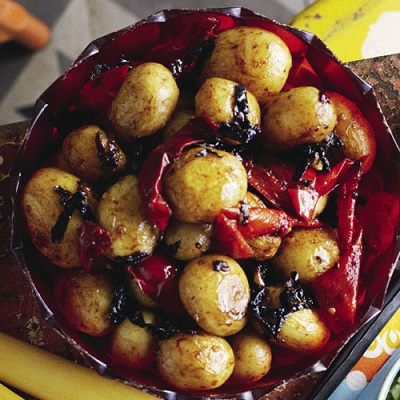

# Potatoes with red chillies

*If you like chillies, you'll love these potatoes! The red chillies add colour, flavour and fire to the finished dish, which is fragranced with warming spices.*

**Serves:** 4

## Overview
Potatoes with red chillies is a vibrant, spice-forward side dish in which par-boiled new potatoes are tossed with toasted whole spices, golden onion, and fiery fresh red chillies. The combination of cumin, fennel, and coriander seeds creates a fragrant base that infuses the potatoes with warmth and depth. Fresh coriander stirred through and used as a garnish adds a bright, herbal finish.

## Ingredients
- 12 small new potatoes (halved)
- 2 tablespoons vegetable oil
- ½ teaspoon crushed dried chillies
- ½ teaspoon white cumin seeds
- ½ teaspoon fennel seeds
- ½ teaspoon crushed coriander seeds
- 1 teaspoon salt
- 1 onion (sliced)
- 2 fresh red chillies (chopped)
- 3 tablespoons coriander (freshly chopped)

## Method
1. Bring a pan of lightly salted water to the boil and cook the potatoes for about 15 minutes until tender, but still firm.
1. Remove from the heat and drain off the water, and set aside until needed.
1. Heat the oil in a deep frying pan and add the crushed chillies, cumin, fennel and coriander seeds.
1. Sprinkle the salt over and fry, stirring continuously for 30 - 40 seconds.
1. Add the sliced onion and fry until golden brown.
1. Tip in the dry potatoes and add the chopped red chillies and 1 tablespoon of the chopped coriander and stir well.
1. Reduce the heat to very low, then cover and cook for 5 - 7 minutes.
1. Serve the potatoes hot, on a heated dish, garnished with the remaining chopped fresh coriander.

## Notes
- Cook the potatoes until just tender but still firm, overcooked potatoes will break apart when tossed in the spice mixture.
- Fry the whole spices and crushed chillies for only 30–40 seconds; any longer and they risk burning and turning bitter.
- Ensure the potatoes are fully drained and as dry as possible before adding to the pan, so the spices coat them rather than steaming off.
- Keep the heat very low when covering to finish cooking, allowing the flavours to meld without drying out or scorching the potatoes.

## Serving
Serve with: grilled or roasted meats, curries, or as part of an Indian-inspired spread
Temperature: hot, served on a warmed dish
Amount: 3 halved potatoes per person as a side dish

## Storage
- Store leftovers in an airtight container in the refrigerator for up to 2 days.
- Reheat in a frying pan over medium heat with a splash of oil, stirring until hot throughout.
- Not suitable for freezing, as the texture of the potatoes becomes watery upon thawing.