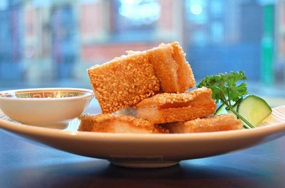

# Prawn toast

*Sesame prawn toast is a savoury snack which is often served in dim sum restaurants outside China.*

**Servings:** 30

## Overview
Prawn toast is a classic dim sum snack of bread spread with a seasoned prawn paste, coated in sesame seeds, and deep fried until golden and crisp. The ginger, soy sauce, and sesame oil in the paste give the filling a distinctly aromatic, umami-rich flavour that contrasts with the crunchy, seed-studded exterior. Popular in Chinese restaurants worldwide, it makes an excellent finger food or starter.

## Ingredients
- 10 thin slices of bread
- 3 tablespoons white sesame seeds
- 400 ml oil for deep frying

### Prawn paste
- 450 grams uncooked peeled prawns
- 1 teaspoon salt
- 1 egg
- 2 tablespoons spring onions (finely chopped)
- 2 teaspoons fresh ginger (finely chopped)
- 1 tablespoon light soy sauce
- 1 teaspoon sesame oil

## Method
### To make the paste
1. Using a cleaver or sharp knife, chop the prawns coarsely and then mince finely into a paste.
1. Put the paste in a bowl and mix in the rest of the ingredients.

### To make the toast
1. If the bread is fresh, place it in a warm oven to dry out (Dry bread absorbs less oil).
1. Remove the crusts and cut the bread into rectangles about 7 cm x 3 cm.
1. Spread the prawn paste on each piece of bread, about 3 mm thick.
1. Sprinkle the toasts with the sesame seeds.

### To cook the toast
1. Heat the oil in a deep fat fryer or wok to a moderate heat.
1. Deep fry several prawn toasts at a time, paste side down for 2 - 3 minutes.
1. Turn them over and deep fry for about 2 minutes or until they are golden brown.
1. Remove with a slotted spoon and drain on kitchen paper.
1. Repeat with the remaining toasts.

## Notes
- Mince the prawns into a very fine paste for the best texture; a coarse paste can cause the topping to fall apart during frying.
- Drying out fresh bread in a warm oven before spreading is important, drier bread absorbs less oil and produces a crispier result.
- Fry paste side down first so the prawn mixture sets and adheres to the bread before it is turned.
- Drain on kitchen paper immediately after frying and serve quickly, as the bread softens as it cools.

## Serving
Serve with: sweet chilli sauce, soy dipping sauce, or plum sauce as a starter or part of a dim sum spread
Temperature: hot, served immediately after frying
Amount: 3 pieces per person as a starter or snack

## Storage
- Best eaten immediately after frying; the texture declines rapidly as the bread absorbs moisture and softens.
- Uncooked prepared toasts can be refrigerated on a tray for up to a few hours before frying.
- Do not freeze once fried; uncooked toasts can be frozen and fried directly from frozen, adding 1–2 minutes to the cooking time.