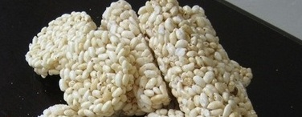

# Rice cake

*Rice cakes were probably invented by a thrifty Chinese cook centuries ago in order to make use of that thin layer of rice which gets stuck to the bottom of the pot. This crispy leftover has evolved into an accompaniment to many dishes. Its taste and crunchy texture go deliciously with Sizzling rice prawns, or as a snack with a touch of oil and salt.*

*The best rice to use for this is long grain white rice. The technique used for cooking is essentially the same as steamed rice, but the cooking time is longer.*

## Overview
Rice cake is a traditional Chinese preparation that transforms the crispy crust that forms at the bottom of a pot of slow-cooked rice into a versatile, crunchy ingredient. Once dried and deep fried, it develops a light, airy texture that sizzles dramatically when dropped into hot soup or stock. It is most famously used in Sizzling Rice Prawns and is a testament to the resourcefulness of Chinese cooking.

## Ingredients
- 225 grams long grain white rice
- 570 ml water
- 2 teaspoons groundnut oil

## Method
### Steaming the rice
1. Wash the rice and put it, with the water in a wide heavy pot.
1. Bring the water to the boil over a high heat, then immediately reduce the heat to very low.
1. Cover and let the rice cook for 45 minutes.
1. The rice should form a heavy crust on the bottom.
1. Remove all the loose surface rice, leaving the heavy crust.
1. This loose rice can be used for making fried rice.

### Making the rice cake
1. Dribble the oil evenly over the top of the crust and let it cook over a very low heat for 5 minutes.
1. The crust should lift off easily at this point. If it is still sticking, add another teaspoon of oil and continue to cook until the whole thing comes loose.
1. Put the crust onto a plate until it is ready for use.
1. Once it has been cooked, it can be left at room temperature for several days. Do not cover it, as moisture will form and the cake will lose its crunchy texture.
1. Let the rice cake dry out, and it is then ready to be deep-fried and put into hot chicken stock to make a soup or used for Sizzling rice prawns.

## Notes
- Use a wide, heavy-based pot to encourage an even, thick crust to form across the bottom of the pan.
- The cooking time of 45 minutes over very low heat is longer than standard steamed rice, resist lifting the lid, as steam is essential to the process.
- Once the crust lifts off, do not cover it during drying; any moisture will destroy the crunchy texture that makes it suitable for deep frying.
- The loose surface rice removed before oiling can be set aside and used for fried rice, avoiding waste.

## Serving
Serve with: Sizzling Rice Prawns, or dropped into hot chicken stock for a soup; can also be served as a snack with a drizzle of oil and salt
Temperature: deep fried immediately before serving so it sizzles on contact with liquid or sauce
Amount: one rice cake (from the bottom of the pot) serves 4 as a component in a dish

## Storage
- Once lifted and dried, the rice cake can be kept uncovered at room temperature for several days.
- Do not cover or refrigerate the dried cake, as moisture will cause it to lose its crunch.
- Deep fry only when ready to serve; once fried it should be used immediately.