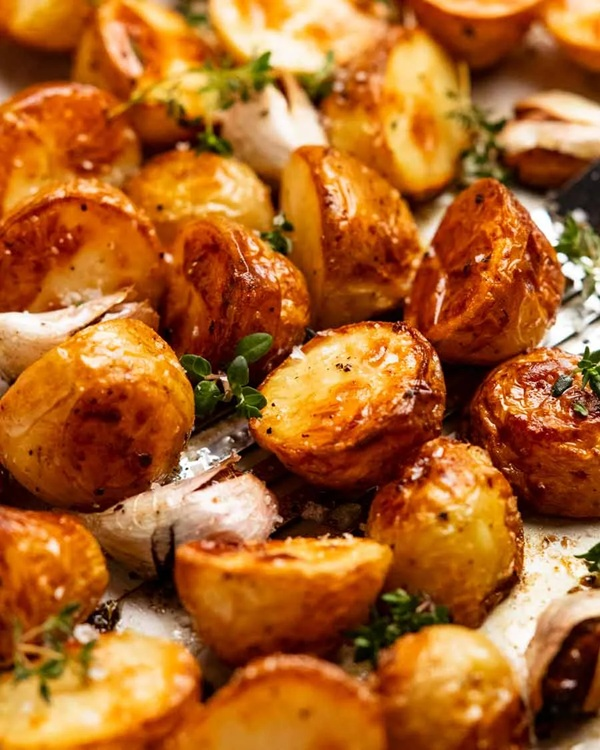

# Perfect Roast Potatoes

*The Sunday lunch obligation: shaggy-edged, crisp-shelled, fluffy-centred potatoes roasted in goose fat or beef dripping. The trick is parboil-until-falling-apart, then shake hard in the colander to rough up the edges. Those edges become the crust.*

**Serves:** 6

**Prep Time:** 15 minutes

**Cook Time:** 1¼ hours

## Overview
Maris Piper potatoes peel and chunk, parboil in well-salted water until just past the point of holding together, drain, shake aggressively in the colander to fluff up the surface. They go into smoking hot fat in a roasting tin, get turned a few times, and emerge with a crust that holds against gravy.

## Ingredients

- 1.5 kg Maris Piper or King Edward potatoes (peeled, cut into 4-5 cm chunks)
- 6 tablespoons goose fat or beef dripping
- 1 tablespoon semolina (optional; helps the crust)
- 4 sprigs fresh rosemary or thyme (optional)
- 4 garlic cloves (skin on, smashed; optional)
- Sea salt

## Method

### Stage 1 – Parboil
1. Place the cut potatoes in a large pan; cover with cold water; add 2 tablespoons of salt.
1. Bring to the boil; cook 8-10 minutes until the edges are softening and a knife slides in with little resistance (the potatoes should be just past cooked through; ALMOST falling apart).

### Stage 2 – Fluff up
1. Drain in a colander.
1. Let steam off for 1 minute.
1. Shake the colander vigorously back and forth — the edges of the potatoes should rough up into a fluffy coating.
1. Sprinkle with semolina if using; toss once more.

### Stage 3 – Heat the fat
1. Heat the oven to 220°C (200°C fan).
1. Put the goose fat in a large roasting tin (one big enough that the potatoes can sit in a single layer).
1. Heat the tin in the oven for 8-10 minutes until the fat is shimmering and almost smoking.

### Stage 4 – Roast
1. Carefully tip the parboiled potatoes into the hot fat (it spits).
1. Turn each potato to coat in the fat.
1. Roast for 30 minutes; turn them.
1. Roast another 25-35 minutes, turning twice more, until deep golden and crisp.
1. Add the herbs and garlic in the last 10 minutes (if using).

### Stage 5 – Serve
1. Salt generously the moment they come out of the oven.
1. Serve immediately while crisp.

## Notes
- **Past-cooked parboil:** Underdone potatoes don't fluff up. They should be on the edge of falling apart when you drain them.
- **Smoking-hot fat:** Cold fat steams the potatoes; you get pale, soft, sad spuds. The fat must be hot enough to crackle on contact.
- **Semolina is the secret:** A light dusting between the parboil and the roasting tin gives an extra layer of crispness. Optional but a serious upgrade.

## Storage
- Eat the moment they're out. Reheating gives crisp-but-leathery potatoes.
