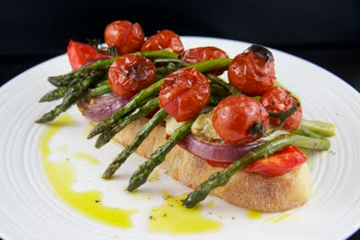

# Roasted vegetable stacks

**Prep Time:** 20 minutes
**Cook Time:** 30 minutes
**Serves:**  4

## Overview
Roasted vegetable stacks are a vibrant and impressive side dish built from layers of oven-roasted peppers, onions, artichokes, asparagus, and tomatoes. The vegetables are stacked on garlic-rubbed griddled bread and finished with a garlic vinaigrette, making them as striking to look at as they are satisfying to eat.

## Ingredients
- 3 red peppers (quartered, cored and pith removed)
- 3 yellow peppers (quartered, cored and pith removed)
- 2 red onions (peeled and halved lengthwise)
- 4 baby artichoke hearts in oil (drained and halved)
- 2 plum or beefsteak tomatoes (halved)
- 12-16 asparagus stalks
- 8 tablespoons garlic vinaigrette
- 15 cm chunk French bread (quartered)
- 1 large garlic clove (unpeeled and cut in half)

## Method
1. Heat the oven to 220°C.
1. Place the peppers, onions, artichokes and tomatoes, cut sides up, in a roasting tin, then add the asparagus. 
1. The vegetables should be in one layer, not stacked on each other. 
1. Drizzle over half the vinaigrette and roast for 30 minutes, removing the asparagus halfway through cooking.
1. Heat a ridged griddle pan until very hot. Rub the bread with the garlic clove, then cook on both sides until toasted and griddle marked. 
1. Place a slice of bread on each plate and stack the roasted vegetables on top in this order: red peppers, yellow peppers, onions, artichokes, a criss-cross of asparagus, and a tomato in half. 
1. Use a skewer to secure them, if necessary.
1. Drizzle with the remaining vinaigrette, season and serve warm.

## Notes
- Remove the asparagus halfway through the 30-minute roasting time to prevent it from overcooking and becoming limp.
- Make sure the vegetables are arranged in a single layer in the roasting tin, stacking them at this stage will cause uneven cooking.
- Rub the bread with the cut side of the garlic while it is still hot from the griddle so the flavour is absorbed effectively.
- A skewer inserted through the centre of each stack helps keep the layers in place when plating and serving.

## Serving
Serve with: grilled meat, fish, or as a standalone vegetarian starter
Temperature: warm
Amount: 1 stack per person

## Storage
- Store leftover roasted vegetables (separated from the bread) in an airtight container in the fridge for up to 3 days.
- Reheat vegetables in a hot oven for 5–10 minutes; the bread is best made fresh as it will become soggy if stored assembled.
- The garlic vinaigrette can be stored separately at room temperature for up to 1 week.