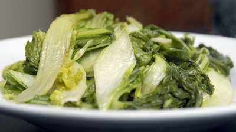

# Spiced Chinese leaves

*Unlike the more familiar green and red cabbage, Chinese leaves have a bland, sweet flavour which is delicate, rather like lettuce. Cooking is needed to make it palatable, and because it is so light, it calls for a robust sauce.
*

**Serves:**  2 - 4

## Overview
Spiced Chinese leaves is a quick stir-fried side dish that transforms the mild, delicate flavour of Chinese leaves with a robust sauce of ginger, garlic, chilli, soy sauce, and sesame oil. The high-heat cooking method brings out a savoury depth that makes it a perfect accompaniment to Asian-style mains.

## Ingredients
- 700 grams Chinese leaves (or white cabbage)
- 1 tablespoon oil
- 2 teaspoons fresh ginger (finely chopped)
- 2 teaspoons garlic (finely chopped)
- 1 dried red chilli
- 1 tablespoons dry sherry or rice wine
- 2 tablespoons dark soy sauce
- 2 teaspoons sugar
- 50 ml water
- 2 teaspoons sesame oil

## Method
1. Separate and wash the leaves well, and cut them into 2 cm wide strips.
1. Heat a large wok or frying pan, and when it is hot, add the oil.
1. A few seconds later add the ginger and stir-fry it quickly.
1. Add the garlic and dried chilli and toss them well for a few seconds.
1. Add the sherry or rice wine, soy sauce, sugar and water.
1. Bring the mixture to a simmer and then add the leaves.
1. Boil over a high heat for 5 minutes until it is thoroughly cooked, stirring occasionally.
1. Just before serving, add the sesame oil, and stir well.

## Notes
- Ensure the wok or pan is properly hot before adding the oil, this is essential for stir-frying rather than stewing the aromatics.
- Add the sesame oil only at the very end, off or just before removing from heat, so it retains its fragrant flavour rather than burning off.
- Cut the leaves into even 2 cm strips so they cook uniformly in the 5-minute boiling stage.
- White cabbage can be substituted for Chinese leaves but will need slightly longer cooking as it is denser.

## Serving
Serve with: steamed rice, stir-fried noodles, or alongside Asian meat or fish dishes
Temperature: hot, straight from the wok
Amount: 2–4 portions as a side dish

## Storage
- Store leftovers in an airtight container in the fridge for up to 2 days.
- Reheat in a hot wok or pan, adding a splash of water to loosen the sauce if needed.
- The dish does not freeze well as the leaves become too soft upon thawing.