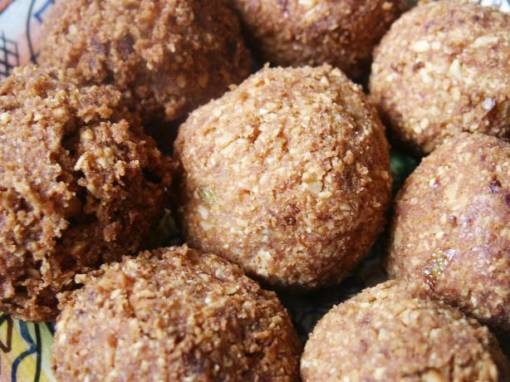

# Spicy peanut balls

*Tasty rice balls, rolled in chopped peanuts and deep-fried, make a delicious snack. Serve them as they are or with a chilli sauce for dipping.*

**Yield:** 16

## Overview
Spicy peanut balls are deep-fried rice balls seasoned with garlic, ginger, chilli, soy sauce, and lime, then coated in chopped peanuts for a satisfying crunch. They make an excellent snack or starter, and pair naturally with a chilli dipping sauce.

## Ingredients
- 1 garlic clove (crushed)
- 1 cm piece root ginger (peeled and finely chopped)
- 1 red chilli (de-seeded and chopped)
- ¼ teaspoon ground turmeric
- 1 teaspoon sugar
- ½ teaspoon salt
- 1 teaspoon chilli sauce
- 2 teaspoons soy sauce
- 2 tablespoon coriander (freshly chopped)
- juice of half a lime
- 225 grams cooked white long grain rice
- 115 grams peanuts (chopped)
- oil (for frying)

## Method
1. Put the crushed garlic, ginger and chilli in a food processor.
1. Add the turmeric and process to a paste.
1. Add the sugar, salt, chilli sauce, soy sauce, coriander and lime juice.
1. Process briefly to mix.
1. Add three-quarters of the cooked rice to the paste in the food processor, and process until smooth and sticky.
1. Scrape into a mixing bowl and stir in the remainder of the rice.
1. Wet your hand and shape the mixture into small balls.
1. Roll the balls, a few at a time in the chopped peanuts, making sure they are evenly coated.
1. Chill the balls in the fridge for 30 minutes.
1. Heat the oil for deep-frying to 180°C, or until a cube of day old bread browns in about 45 seconds.
1. Deep fry the peanut balls until crisp.
1. Drain on kitchen paper, then pile on to a platter.

## Notes
- Chilling the shaped balls for 30 minutes before frying is important, it helps them hold together and prevents them from breaking apart in the oil.
- Wet your hands when shaping the balls to stop the sticky rice mixture from adhering to your fingers.
- Processing only three-quarters of the rice to a smooth paste and stirring in the remainder gives the balls a better texture with some bite.
- Test the oil temperature with a cube of day-old bread (it should brown in about 45 seconds) before frying to ensure even, crisp results.

## Serving
Serve with: chilli dipping sauce or sweet chilli sauce on the side
Temperature: hot, straight from the fryer
Amount: 3–4 balls per person as a snack or starter

## Storage
- Store unfried, chilled balls in the fridge for up to 24 hours before frying.
- Once fried, store leftovers in an airtight container in the fridge for up to 2 days and reheat in a hot oven until crisp.
- The balls are not suitable for freezing once fried as the coating loses its crunch.