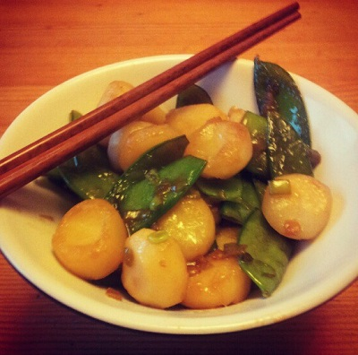

# Stir fried mange tout with waterchestnuts

*This sweet crunchy side dish is a perfect accompaniment to any Chinese dish, but works especially well with lemon chicken.*

**Servings:** 2 - 4

## Overview
Stir-fried mange tout with waterchestnuts is a quick, sweet, and crunchy side dish that comes together in under 10 minutes. The combination of tender mange tout and crisp waterchestnuts, seasoned with soy sauce, sesame oil, and a touch of sugar, makes it a versatile companion to Chinese-style mains.

## Ingredients
- 225 grams waterchestnuts (drained)
- 1 tablespoon groundnut oil
- 3 tablespoons spring onions (finely chopped)
- 225 grams mange tout (trimmed)
- 1 tablespoon light soy sauce
- 2 tablespoons water
- ½ teaspoon salt
- ½ teaspoon sugar
- 1 teaspoon sesame oil

## Method
1. Drain,rinse and thinly slice the waterchestnuts.
1. Heat a wok or large frying pan over a medium heat.
1. Add the oil, and when it is hot, add the spring onions.
1. A few seconds later, add the mange tout and stir fry them. If you are using fresh waterchestnuts, add these now.
1. Stir fry for 1 minute, making sure everything is coated thoroughly in oil.
1. Add the soy sauce, water, salt, sugar and sesame oil.
1. Stir fry for a further 3 minutes.
1. If you are using tinned waterchestnuts, add these and cook for a further 2 minutes.
1. Serve immediately.

## Notes
- If using tinned waterchestnuts, add them at the end of cooking to warm through rather than at the start, as they are already soft and will become mushy if overcooked.
- Fresh waterchestnuts go in early (with the mange tout) as they need longer to cook and will hold their crunch better throughout.
- Ensure the oil is hot before adding the spring onions so they sizzle and become fragrant rather than steaming.
- This dish must be served immediately, the mange tout will lose their bright colour and crunch if left to sit.

## Serving
Serve with: lemon chicken, steamed rice, or any Chinese-style main course
Temperature: hot, straight from the wok
Amount: 2–4 portions as a side dish

## Storage
- Best eaten immediately; leftovers can be stored in an airtight container in the fridge for up to 2 days.
- Reheat briefly in a hot wok, the texture will soften but the flavour remains good.
- Not suitable for freezing as the mange tout will become limp.