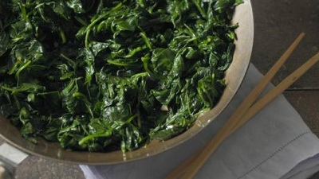

# Stir fried spinach with garlic

*Spinach has often been regarded with disdain in the West, probably because it is often overcooked. This is a time-honoured, delicious southern Chinese recipe. The spinach is quickly stir-fried and then seasoned. It is very simple to prepare and tastes divine.*

**Serves:**  4

## Overview
Stir-fried spinach with garlic is a classic southern Chinese side dish that showcases how quickly and simply spinach can be cooked to perfection. The leaves are wilted in a hot wok with oil, salt, sugar, and garlic, resulting in a tender, flavoursome dish that is ready in under 10 minutes.

## Ingredients
- 700 grams fresh spinach
- 1 tablespoon oil
- ½ teaspoon salt
- 1 teaspoon sugar
- 2 teaspoons garlic (finely chopped)

## Method
1. Wash the spinach thoroughly, removing all the stems and leaving just the leaves.
1. Heat a large wok or pan to a moderate heat and add the oil, salt and spinach.
1. Stir-fry for 2 minutes to coat the spinach thoroughly with the oil and salt.
1. When the spinach has wilted to about one-third of its original size, add the sugar and garlic and continue to stir-fry for another 4 minutes.
1. Transfer the spinach to a plate and pour off any excess liquid.

## Notes
- Remove all the stems before cooking, they take longer to cook than the leaves and result in an uneven texture.
- Add the garlic and sugar only after the spinach has wilted, not at the start, to prevent the garlic from burning in the hot wok.
- Pour off the excess liquid before serving so the dish is not watery, spinach releases a significant amount of moisture as it wilts.
- Use the full 700 grams even though it looks like a large quantity; spinach reduces dramatically to about one-third of its original volume during cooking.

## Serving
Serve with: steamed rice or as a side alongside any Chinese-style main course
Temperature: hot, served immediately after draining
Amount: 4 portions as a side dish

## Storage
- Store leftovers in an airtight container in the fridge for up to 2 days.
- Reheat briefly in a hot wok or microwave; pour off any additional liquid that has gathered.
- Not suitable for freezing as the spinach becomes watery and loses its texture.