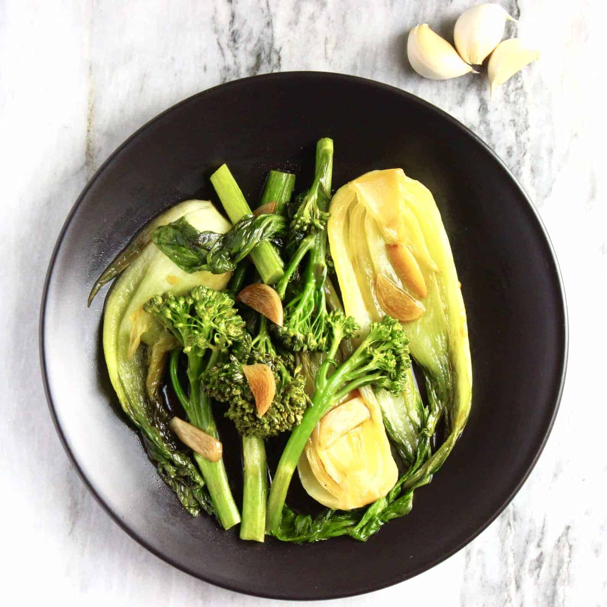

# Wok-Fried Greens

*Wagamama's signature side: tenderstem broccoli, bok choy and snap peas blasted in a hot wok with garlic, ginger, soy and a splash of mirin until just-tender and bright. The greens stay crunchy in the centre; the surface picks up that scorched, smoky wok flavour. Eats alongside ramen, noodles, or rice.*

**Serves:** 2 (as a side)

**Prep Time:** 5 minutes

**Cook Time:** 5 minutes

## Overview
A wok or wide pan gets very hot; oil goes in; garlic and ginger flash; the firmest greens (broccoli stems) go first; bok choy and snap peas follow; soy and mirin glaze; sesame oil at the end. The whole thing takes 4-5 minutes from heat to plate. Speed and heat matter.

## Ingredients

- 200 g tenderstem broccoli (trimmed; thicker stems halved lengthwise)
- 2 small heads bok choy or pak choi (around 200 g; halved lengthwise)
- 100 g sugar snap peas
- 2 tablespoons vegetable oil
- 4 garlic cloves (sliced thin)
- 2 cm fresh ginger (julienned)
- 2 tablespoons light soy sauce
- 1 tablespoon mirin
- 1 teaspoon rice vinegar
- 2 teaspoons toasted sesame oil
- 1 teaspoon toasted sesame seeds (to finish)
- 1 long red chilli (sliced; optional)

## Method

### Stage 1 – Prep before lighting the wok
1. Have everything cut and within reach of the hob — the dish takes minutes; you can't pause to chop.

### Stage 2 – Heat the wok
1. Heat the wok over the highest heat 2-3 minutes until it smokes faintly.
1. Add the oil; swirl to coat.

### Stage 3 – Aromatics
1. Add the garlic and ginger; toss for 15 seconds — they should sizzle furiously, not burn.

### Stage 4 – Broccoli
1. Add the tenderstem broccoli; toss vigorously for 90 seconds. The stems should blister and char in places.

### Stage 5 – Bok choy and snap peas
1. Add the bok choy and snap peas; toss for 60 seconds — bok choy should wilt slightly, snap peas should still snap.

### Stage 6 – Glaze
1. Pour in the soy sauce, mirin and vinegar around the edge of the pan; toss to coat. The liquid should reduce to almost nothing in 30 seconds.

### Stage 7 – Finish
1. Off the heat, drizzle the sesame oil; toss once.
1. Tip onto a plate; scatter sesame seeds and chilli slices.
1. Eat immediately while the greens are still hot and crisp.

## Notes
- **High heat is non-negotiable:** Lower heat steams the greens; you want char and smoke. A domestic gas hob on its highest setting; or get a takeaway-style wok burner if you cook this often.
- **Bok choy halves cut-side down:** When you add them, lay halves flat in the pan for 30 seconds before tossing — the cut side caramelises briefly.
- **Don't crowd the wok:** Half quantities cook faster and better than a full wok-load. Cook in batches if you scale up.

## Storage
- Best fresh; the textures collapse on reheat. Make to order.
