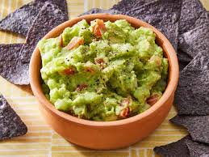

# Guacamole

*Mexican avocado dip: ripe avocados mashed with lime, salt, white onion, fresh chilli and coriander. The pure version has no tomato, no cumin, no sour cream, no extras. The simpler version is the better one.*

**Serves:** 4-6 (as a dip)

**Prep Time:** 10 minutes

**Cook Time:** 0 minutes

## Overview
Avocados halve, scoop out, mash chunky (not smooth — texture matters). Onion finely chops, jalapeño deseeds and chops, coriander chops. Lime juice, salt, mix. Eat immediately or press cling film flat onto the surface to slow oxidation.

## Ingredients

- 3 ripe avocados (yields readily to gentle pressure)
- 1 small white onion (very finely chopped)
- 1 jalapeño or serrano chilli (seeds removed for less heat; finely chopped)
- A small bunch of fresh coriander (chopped)
- Juice of 1 lime (plus more to taste)
- 1 teaspoon flaky sea salt (plus more to taste)

### Optional
- 1 small ripe tomato (seeded, finely diced) — for the salsa-style version

## Method

### Stage 1 – Avocados
1. Halve the avocados; remove the stones; scoop the flesh into a bowl.

### Stage 2 – Mash
1. Mash with a fork to your preferred texture; chunky is traditional, smooth is fine. Don't blitz — it goes brown faster.

### Stage 3 – Mix
1. Add the onion, chilli, coriander, lime juice and salt.
1. Stir to combine; don't overwork.

### Stage 4 – Taste and adjust
1. The lime should be assertive; the salt should be present. If either feels muted, add more.

### Stage 5 – Serve
1. Pile into a small bowl.
1. Top with extra coriander leaves and a final squeeze of lime.
1. Serve with tortilla chips, on tacos, or beside grilled meat.

## Notes
- **Ripe avocados only:** Hard avocados give pale, bland guacamole. Wait until they yield to a thumb press.
- **Salt is structural:** Under-salted guacamole tastes flat. Be generous; flaky salt is best.
- **Press cling film flat:** If you must store, smooth the surface and press cling film directly onto it (no air gap). The brown layer is just oxidised; mix it back in.

## Storage
- Best fresh. Keeps 1 day refrigerated under cling film pressed onto the surface.
- Don't freeze.
