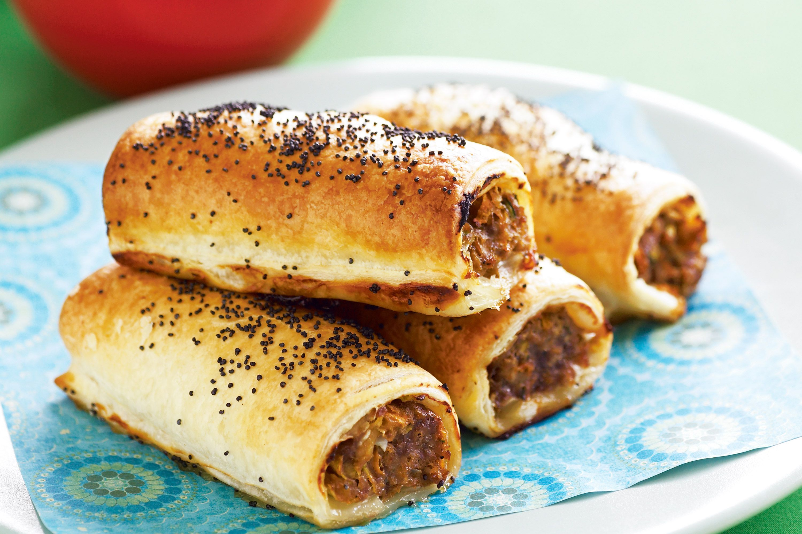

# Sausage Rolls

*The British party staple: seasoned sausage meat wrapped in puff pastry, brushed with egg wash, baked until the pastry is shatteringly crisp and the filling is hot. Best served warm. Make a batch the day before and reheat; perfect for a buffet or a lunchbox.*

**Makes:** 24 small rolls

**Prep Time:** 30 minutes

**Cook Time:** 25 minutes

## Overview
Sausagemeat (or sausage casings squeezed) mixes with herbs, mustard and breadcrumbs for a lighter texture. The mixture pipes onto strips of puff pastry, the pastry rolls over and seals, and the long rolls cut into bite-sized pieces. Egg wash, sesame seeds, bake.

## Ingredients

### Filling
- 600 g good-quality sausagemeat (or 800 g sausages, casings removed and squeezed out)
- 1 small onion (very finely chopped)
- 1 tablespoon Dijon mustard
- 2 tablespoons fresh sage or thyme (finely chopped) or 1 teaspoon dried
- 50 g fresh breadcrumbs
- 1 teaspoon ground black pepper
- ½ teaspoon salt

### Pastry
- 2 sheets all-butter puff pastry (about 320 g each), chilled
- 1 large egg (beaten, for egg wash)
- 1 tablespoon sesame seeds or poppy seeds (optional)

## Method

### Stage 1 – Prep the filling
1. Cook the chopped onion in a small splash of oil for 5 minutes until soft. Cool.
1. In a bowl, mix the sausagemeat, cooled onion, mustard, herbs, breadcrumbs, pepper and salt thoroughly.
1. Divide into 4 equal portions (one per pastry strip).

### Stage 2 – Roll the pastry
1. Heat the oven to 200°C (180°C fan).
1. Unroll the puff pastry; cut each sheet in half lengthways (4 long strips total).
1. Pipe or shape a long roll of sausagemeat down the centre of each strip (about 2 cm thick).

### Stage 3 – Wrap and seal
1. Brush one long edge of each pastry strip with beaten egg.
1. Fold the unbrushed edge over the filling to meet the brushed edge; press to seal firmly.
1. Place each long roll seam-side down on a parchment-lined baking tray.

### Stage 4 – Cut and finish
1. Score the top of each long roll diagonally every 4 cm (don't cut through; just shallow marks).
1. Cut into 4 cm pieces with a sharp knife.
1. Brush the tops with beaten egg; scatter sesame or poppy seeds.

### Stage 5 – Bake
1. Bake for 20-25 minutes until the pastry is deep golden and crisp.
1. Cool 5 minutes on the tray; serve warm.

## Notes
- **Don't overstuff:** Too much filling and the pastry tears or unrolls in the oven. Aim for filling and pastry roughly equal in cross-section.
- **All-butter pastry:** The flavour difference vs. shortcut puff pastry is enormous. Worth it for the buffet.
- **Make ahead:** Shape, freeze on a tray, then bag. Bake from frozen, adding 5-8 minutes.

## Storage
- Best warm from the oven. Keeps 2 days; reheat at 180°C for 8 minutes.
- Freezes raw or baked, 2 months.
