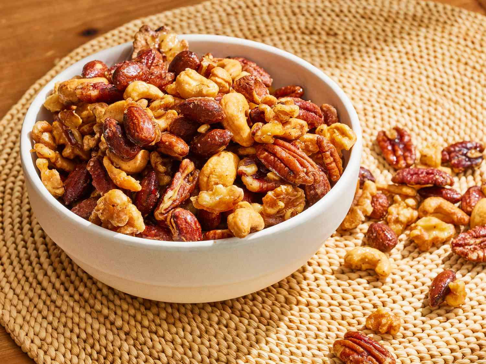

# Spiced Mixed Nuts

*Roasted nuts with rosemary, smoked paprika, butter and a pinch of cayenne. The cocktail-hour staple; far better than any bag from a shop. Makes a generous gift, keeps a fortnight in a tin, vanishes faster than that in any household.*

**Makes:** 500 g

**Prep Time:** 5 minutes

**Cook Time:** 15 minutes

## Overview
Nuts roast briefly in a hot oven to bring out their oils. Melted butter mixes with rosemary, smoked paprika, cayenne, brown sugar and salt. The hot nuts toss in this glaze; back to the oven for a few more minutes to set; cool on a tray.

## Ingredients

- 500 g mixed unsalted nuts (cashews, almonds, pecans, walnuts, hazelnuts in any combination)
- 50 g unsalted butter
- 2 tablespoons fresh rosemary (finely chopped)
- 1 tablespoon brown sugar
- 1 teaspoon smoked paprika
- ½ teaspoon cayenne pepper
- 1 teaspoon flaky sea salt
- ½ teaspoon ground black pepper
- A few drops Worcestershire sauce (optional)

## Method

### Stage 1 – Roast the nuts
1. Heat the oven to 180°C (160°C fan).
1. Spread the nuts on a baking tray.
1. Roast 8-10 minutes until fragrant and lightly golden (don't go further; they'll roast more in the next step).

### Stage 2 – Glaze
1. Melt the butter in a small pan.
1. Stir in the rosemary, sugar, paprika, cayenne, salt, pepper and Worcestershire (if using).

### Stage 3 – Toss and finish
1. Tip the hot nuts into a large bowl; pour the spiced butter over.
1. Toss thoroughly until evenly coated.
1. Spread back onto the tray.
1. Return to the oven for 5-6 minutes more.

### Stage 4 – Cool
1. Cool completely on the tray (the glaze sets and the nuts crisp).
1. Break apart any clumps; transfer to a tin or jar.

## Notes
- **Unsalted nuts:** You're seasoning at the end; pre-salted nuts give too-salty results.
- **Rosemary chopped fine:** Big sprigs char and turn bitter; finely chopped distributes evenly and toasts gently.
- **Mixed nuts > single variety:** The variety is part of the appeal — softer cashews, crunchier almonds, oilier walnuts.

## Storage
- Keeps 2 weeks in an airtight tin.
- Don't freeze; the spice glaze loses its crispness.
