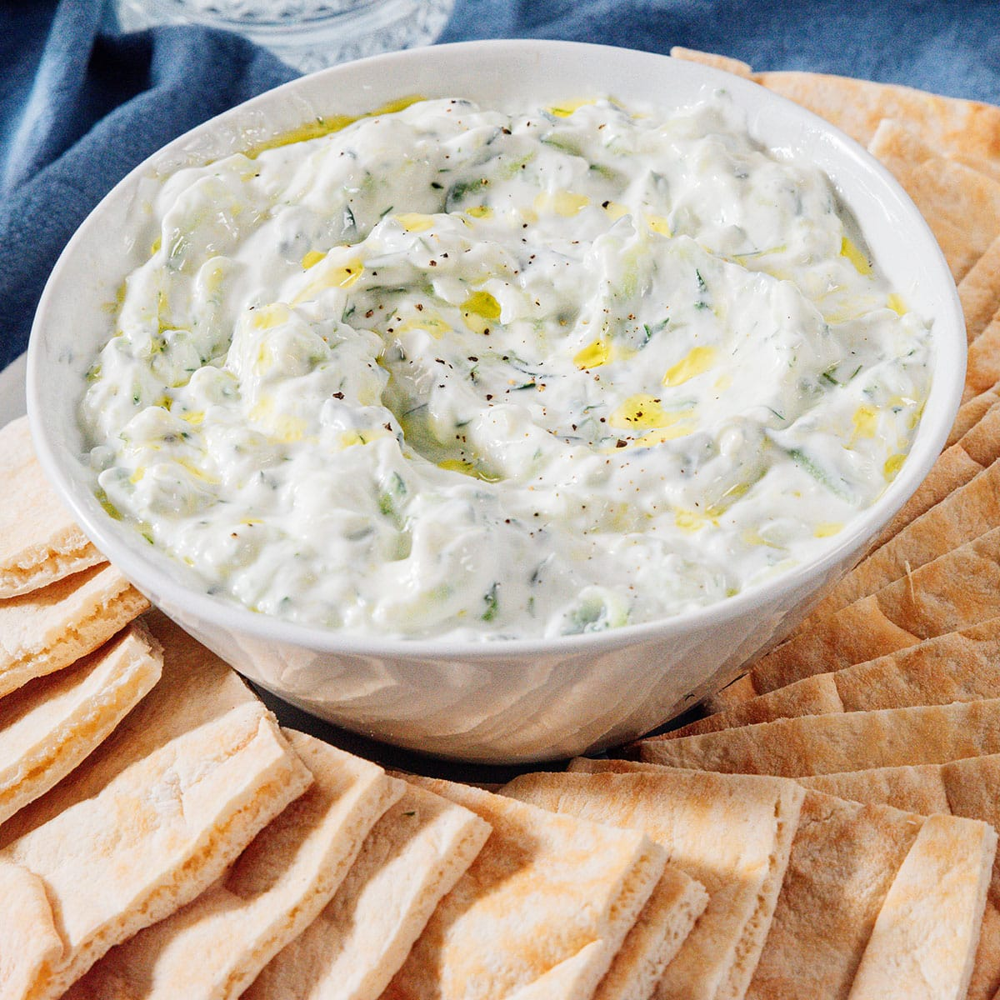

# Tzatziki

*Greek yogurt dip with grated cucumber, garlic, dill and a splash of olive oil. The Greek table staple; goes with bread, grilled meats, vegetables, anything. The trick is squeezing the cucumber dry — wet cucumber gives a watery dip.*

**Serves:** 4-6 (as a dip)

**Prep Time:** 15 minutes (plus 30 minutes drain)

**Cook Time:** 0 minutes

## Overview
Cucumber grates, salts, sits in a sieve to drain. Squeezed thoroughly. Mixes with thick Greek yogurt, crushed garlic, dill (or mint), olive oil, lemon and salt. Served chilled with a final swirl of oil and dill on top.

## Ingredients

- 1 cucumber (peeled if waxy, otherwise leave the skin)
- 1 teaspoon salt (for draining)
- 400 g full-fat Greek yogurt (the thick strained kind)
- 3 garlic cloves (crushed)
- 1 tablespoon extra virgin olive oil (plus more to finish)
- 1 tablespoon lemon juice
- 2 tablespoons fresh dill (chopped) or fresh mint
- ½ teaspoon salt
- A grind of black pepper

## Method

### Stage 1 – Drain the cucumber
1. Halve the cucumber lengthways; scrape out the seeds with a teaspoon.
1. Coarsely grate or finely chop.
1. Toss with the teaspoon of salt; sit in a sieve over a bowl for 30 minutes.
1. Squeeze the cucumber HARD in a clean cloth or your hands until very little water comes out (this is essential).

### Stage 2 – Mix
1. In a bowl, combine the squeezed cucumber, yogurt, garlic, olive oil, lemon juice, dill, salt and pepper.
1. Stir until well combined.
1. Taste; the dip should be assertive — bright with lemon, garlic-forward, salted enough.

### Stage 3 – Chill
1. Refrigerate at least 30 minutes for flavours to meld (longer is fine; up to a day).

### Stage 4 – Serve
1. Spoon into a shallow bowl.
1. Make a swirl with the back of a spoon; pool a little olive oil in it.
1. Scatter extra dill or mint.

## Notes
- **Squeeze the cucumber:** Most home tzatziki fails here. Wet cucumber dilutes everything. Get it bone-dry.
- **Greek yogurt thick:** Strained Greek yogurt; not "Greek-style" yogurt which is thinner. If using regular yogurt, drain through muslin for an hour.
- **Dill OR mint, not both:** Each gives a different dish. Dill is the more common; mint tilts more toward Turkish cacık.

## Storage
- Keeps 3-4 days refrigerated; the cucumber softens but the flavour holds. Stir before serving.
