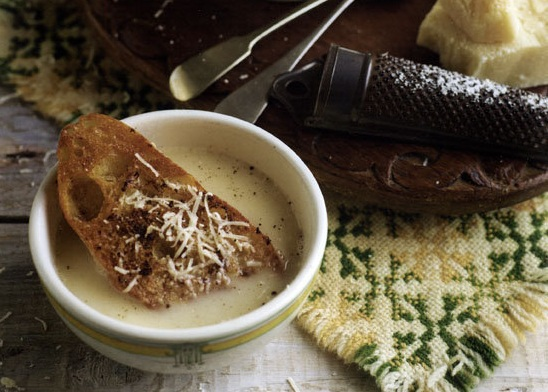

# Beef and wine soup

*Eisacktaler Weinsuppe*

*From Eisacktaler in the Italian Valle d'Isarco - the extreme eastern part of the Alps - comes this heart-warming and delightful soup. There as as many people speak German as they do Italian, thus the name 'wine soup', a good example of the influence neighbouring countries have on the Italian regions and their food.*

**Serves:** 4

**Prep Time:** 10 minutes

**Cook Time:** 10 minutes

## Overview
This comforting beef and wine soup from the Italian Alps combines rich beef stock with white wine for a warming broth. Topped with cinnamon-spiced toasted bread and creamy Parmesan, it's a simple yet elegant dish that highlights the region's culinary influences. Perfect for a cozy meal.

## Ingredients

### Seasonings
- 1 litre strong beef stock or broth
- 500 ml white wine
- ½ teaspoon ground cinnamon
- 100 ml double cream

### Bread
- 4 slices country bread

### Fat
- 40 grams unsalted butter

### Cheese
- 100 grams freshly grated Parmesan
- Freshly grated Parmesan - to serve

## Method

### Stage 1 – Prepare bread
1. Fry the bread in the butter on both sides until golden.
1. Sprinkle the cinnamon over each slice of bread.

### Stage 2 – Cook soup
1. Put the stock and the wine together in a large saucepan and bring to the boil.
1. Cook for 1 minute only.
1. Remove from the heat and set aside.
1. Add the cream to the soup and heat gently to warm through.
1. Stir the Parmesan into the soup.

### Stage 3 – Assemble and serve
1. Put one slice of bread in each soup bowl.
1. Pour the soup over the bread and sprinkle with a little more Parmesan.

## Notes
- **Bread:** Use stale bread for better texture when toasting.
- **Cheese:** Freshly grated Parmesan melts better and adds more flavor.
- **Wine:** Choose a dry white wine that complements the beef stock.

## Serving
Serve hot, sprinkled with extra freshly grated Parmesan.

## Storage
- Best served immediately; soup base can be refrigerated for 2 days. Reheat gently and assemble fresh.