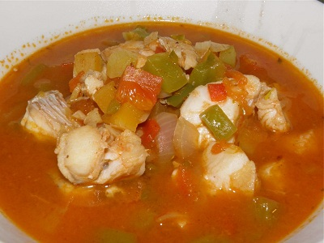

# Caribbean fish soup

**Serves:** 6

**Prep Time:** 20 minutes

**Cook Time:** 30 minutes

## Overview
A vibrant Caribbean soup featuring fresh fish poached in a spicy tomato-based broth with sweet potatoes and aromatic vegetables. The scotch bonnet chilli adds authentic heat, balanced by fresh lime juice for a refreshing finish.

## Ingredients

### Base
- 2 tablespoons oil

### Aromatics
- 4 shallots (finely chopped)
- 2 celery stalks (chopped)
- 1 scotch bonnet chilli (de-seeded and finely chopped)

### Vegetables
- 2 tomatoes
- 1 large red pepper
- 275 grams sweet potato (peeled and cut into cubes)

### Protein
- 500 grams cod (skinless)

### Seasonings
- ½ teaspoon ground allspice
- ½ teaspoon nutmeg (freshly grated)
- 3 tablespoons lime juice

### Liquid/Broth
- 875 ml fish stock

## Method

### Stage 1 – Prepare vegetables
1. Rub the pepper skin with oil, and grill skin-side up under a hot grill for 5 - 6 minutes, or until the skin blackens and blisters.
2. Seal the peppers in a plastic bag to sweat. Once cooled, remove the skin from the peppers with your fingers.
3. Chop the pepper into medium dice.
4. Score a cross in the base of each tomato.
5. Soak in boiling water for 30 seconds, and plunge into ice cold water.
6. Drain and peel the skin away from the cross.
7. Chop the tomatoes, discarding the core and reserving the juices.

### Stage 2 – Cook aromatics
1. Heat the oil in a large saucepan, then add the shallots, celery, red pepper, chilli, allspice and nutmeg.
2. Cook for 4 - 5 minutes, or until the vegetables have softened, stirring occasionally.

### Stage 3 – Build broth
1. Add the chopped tomatoes and the reserved juices, along with the stock and bring to the boil.
2. Immediately reduce the heat to medium and add the cubes of sweet potato.
3. Season to taste and cook for about 15 minutes, or until the sweet potato is tender.

### Stage 4 – Add fish and finish
1. Add the lime juice and chunks of fish to the saucepan and poach gently for 4 - 5 minutes, or until the fish is cooked through and the skin is white.
2. Season to taste and serve immediately.

## Notes
- **Scotch bonnet chilli:** Adjust quantity for heat preference; it's very spicy.
- **Fish stock:** Use fresh or high-quality store-bought for best flavor.
- **Sweet potato:** Cut into even cubes for uniform cooking.
- **Timing:** Don't overcook the fish; it should be just opaque.

## Serving
Serve hot with crusty bread or rice. Garnish with fresh herbs if desired.

## Storage
- Refrigerate up to 2 days; reheat gently.
- Freezes well for up to 1 month.
- Best eaten fresh for optimal fish texture.