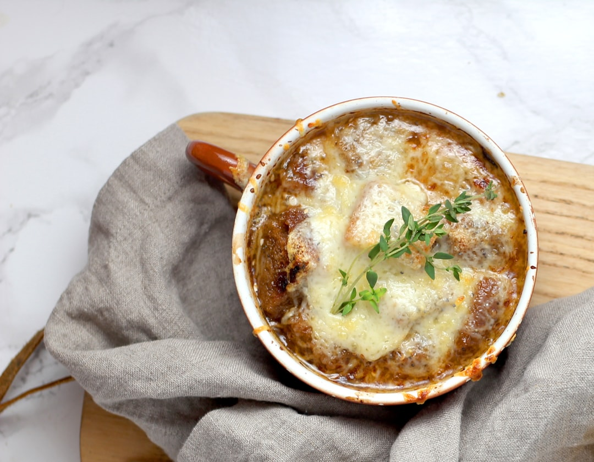

# French Onion Soup

**Serves:** 6

**Prep Time:** 10 minutes

**Cook Time:** 50 minutes

## Overview
Classic French soup with caramelized onions, rich broth, and cheesy bread topping.

## Ingredients
### Fat
- 50 grams butter

### Vegetables
- 750 grams onions (finely sliced)
- 2 garlic cloves (crushed)

### Seasonings
- 45 grams plain flour
- 2 litres stock (beef or chicken)
- 250 ml dry white wine
- 1 bay leaf
- 2 thyme sprigs

### Bread
- 12 slices stale baguette

### Cheese
- 100 grams Gruyère cheese (finely grated)

## Method

### Stage 1 – Caramelize onions
1. Melt the butter in a heavy-based saucepan and add the onions.
1. Cook over a low heat, stirring occasionally, for 25 minutes, or until the onion is deep golden brown and beginning to caramelise.

### Stage 2 – Make soup base
1. Add the garlic and flour and stir continuously for 2 minutes.
1. Gradually blend in the stock and wine, stirring continuously.
1. As soon as the soup begins to boil, add the bay leaf along with the thyme, and check for seasoning.
1. Lower the heat, and cover the pan and simmer for 25 minutes.
1. Remove the bay leaf and thyme.

### Stage 3 – Assemble and serve
1. Preheat the grill.
1. Toast the baguette slices, then divide among six soup bowls.
1. Ladle the soup over the top and sprinkle with the grated cheese.
1. Grill until the cheese melts and turns light golden brown.
1. Serve immediately.

## Notes
- **Onions:** Caramelize slowly for sweetness; don't rush.
- **Stock:** Use beef for richness; vegetable for vegetarian.
- **Bread:** Stale bread works best for toasting.
- **Cheese:** Gruyère melts beautifully; grate fresh.

## Serving
- Serve hot with toasted bread and melted cheese.

## Storage
- Refrigerate soup base up to 3 days; assemble fresh.