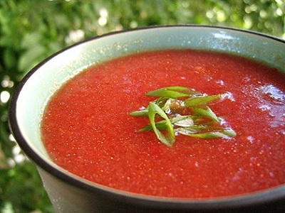

# Gazpacho

*This wonderful chilled soup originated in Andalucía, Spain. A perfect dish for the hot summer months due to its refreshing qualities and cold serving temperature.*

**Serves:** 4

**Prep Time:** 20 minutes

**Cook Time:** 0 minutes

## Overview
This refreshing chilled Spanish soup from Andalucía features ripe tomatoes, crisp cucumber, and bell peppers blended into a smooth, tangy puree. No cooking required, it's a vibrant and healthy dish perfect for hot days. Served with a fresh vegetable garnish for added texture.

## Ingredients

### Vegetables
- 1 kg vine-ripened tomatoes (chopped)
- 1 cucumber (chopped)
- 1 small red pepper (de-seeded and chopped)
- 1 red onion (chopped)

### Aromatics
- 3 garlic cloves

### Bread
- 80 grams sourdough bread (crusts removed)

### Seasonings
- 2 tablespoons sherry vinegar
- a few drops of Tabasco sauce

### Dressing
- 2 teaspoons tomato (de-seeded and finely diced)
- 2 teaspoons red pepper (de-seeded and finely diced)
- 2 teaspoons cucumber (de-seeded and finely diced)
- 2 teaspoons onion (finely diced)
- 1 tablespoon extra virgin olive oil
- 1 teaspoon lemon juice

## Method

### Stage 1 – Blend soup
1. Combine the gazpacho ingredients into a blender with 250 ml cold water and blend until smooth. Pass through a fine-meshed conical sieve into a bowl and season to taste.

### Stage 2 – Prepare dressing
1. Combine all the dressing ingredients together in a bowl, season to taste.

### Stage 3 – Chill and serve
1. Cover the soup with cling-film and refrigerate overnight to allow the flavours to develop.
1. Stir the Gazpacho well and decant into 4 bowls.
1. Spoon the dressing in the centre of each bowl of Gazpacho before serving.

## Notes
- **Chilling:** Refrigerate overnight for best flavor development; can be made a day ahead.
- **Bread:** Stale bread absorbs flavors better; remove crusts to avoid bitterness.
- **Consistency:** Adjust water for desired thickness; blend longer for smoother texture.

## Serving
Serve chilled with the vegetable dressing in the center.

## Storage
- Refrigerate up to 3 days; flavors improve over time. Stir well before serving.