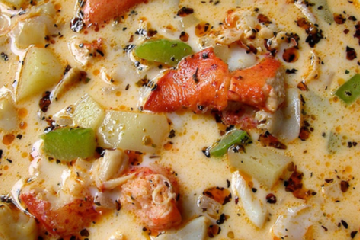

# Manhattan seafood chowder

**Serves:** 4

**Prep Time:** 15 minutes

**Cook Time:** 30 minutes

## Overview
This hearty Manhattan seafood chowder combines fresh clams, cod, and prawns in a tomato-based broth with potatoes and bacon. A classic American dish from New York, it's rich, flavorful, and perfect for seafood lovers. Serve with crusty bread for a complete meal.

## Ingredients

### Fat
- 60 grams butter

### Protein
- 3 bacon slices (chopped)
- 1 kg baby clams
- 375 grams skinless cod fillets (cut into cubes)
- 12 large prawns (peeled and de-veined, tails intact)

### Vegetables
- 2 onions (chopped)
- 2 celery stalks (sliced)
- 3 potatoes (diced)
- 400 grams tinned tomatoes (chopped)

### Aromatics
- 2 garlic cloves (finely chopped)
- 3 teaspoons thyme (chopped)

### Seasonings
- 1.25 litres fish stock
- 1 tablespoon tomato purée
- 2 tablespoons flat leaf parsley (chopped)

## Method

### Stage 1 – Prepare clams and base
1. Wash the clams thoroughly, discarding any that have broken shells or fail to close when you tap them.
1. Melt the butter in a saucepan over a low heat.
1. Add the bacon, onion, garlic and celery and cook, stirring occasionally for 5 minutes or until soft.
1. Add the potato, thyme and 1 litre of the stock to the saucepan and bring to the boil.
1. Reduce the heat to low and simmer, covered, for 15 minutes.

### Stage 2 – Cook chowder
1. Pour in the remaining stock and bring to the boil.
1. Add the clams, cover and cook for 3 - 5 minutes, or until they open.
1. Discard any clams that do not open.
1. Drain the clam liquor through a wet muslin-lined sieve into a clean bowl, and pour back into the soup.
1. Pull most of the clams out of their shells, leaving a few intact to garnish, and set aside.
1. Stir the tomato purée and chopped tomatoes into the soup and bring back to the boil.

### Stage 3 – Add seafood and finish
1. Add the fish, clams and prawns and simmer over a low heat for 3 minutes, or until the seafood is cooked.
1. Season and stir in the parsley.
1. Serve with the clams in their shells scattered over the soup.

## Notes
- **Clams:** Use fresh clams; discard any that don't open during cooking.
- **Seafood:** Don't overcook; add at the end for tenderness.
- **Tomatoes:** Tinned tomatoes add richness; fresh can be used in season.

## Serving
Serve hot with crusty bread.

## Storage
- Best served immediately; refrigerate up to 1 day. Reheat gently without boiling.