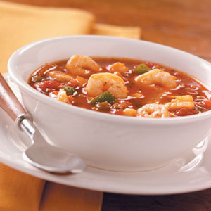

# Mexican soup with salsa

**Serves:** 4

**Prep Time:** 15 minutes

**Cook Time:** 30 minutes

## Overview
This vibrant Mexican seafood soup features halibut, prawns, scallops, and clams in a spicy tomato broth with corn and lime. Topped with a fresh avocado salsa, it's a zesty and flavorful dish that brings the tastes of Mexico to your table. Perfect for a light yet satisfying meal.

## Ingredients

### Fat
- 3 tablespoons olive oil

### Vegetables
- 1 large onion (chopped)
- 2 corn cobs (kernels removed)
- 800 grams tinned chopped tomatoes

### Aromatics
- 3 garlic cloves (crushed)
- 2 thin red chillies (thinly sliced)
- 2 bay leaves
- 1 teaspoon dried oregano

### Protein
- 500 grams halibut fillets
- 12 prawns
- 8 scallops (cleaned)
- 12 clams

### Seasonings
- 200 ml fish stock
- 1 teaspoon caster sugar
- 2 tablespoons coriander leaves (chopped)
- juice of 2 limes
- 125 grams double cream

### Salsa
- half an avocado
- 1 tablespoon coriander leaves (finely chopped)
- grated zest and juice of 1 lime
- half an red onion (finely chopped)

## Method

### Stage 1 – Cook base
1. Wash the clams thoroughly, discarding any that have broken shells or fail to close when you tap them.
1. Heat the oil in a saucepan, add the onion and celery and cook over a medium heat for 10 minutes.
1. Add the garlic and chilli and cook for 1 minute, stirring continuously.
1. Add the fish stock and tomatoes, stir in the bay leaves, oregano and sugar.
1. Bring to the boil, and immediately reduce the heat to low and simmer for 10 minutes.
1. Remove the bay leaves, then tip the sauce into a food processor and purée until smooth.
1. Return the sauce to the pan and season.
1. Add the corn kernels and bring back to the boil.
1. Reduce the heat and simmer for 3 minutes.

### Stage 2 – Add seafood
1. Cut the fish into chunks.
1. Stir in the coriander and lime juice, add the fish, then simmer for 1 minute.
1. Add the prawns, scallops and clams.
1. Cover with a lid and cook for a further 2 - 3 minutes, discard any clams that have failed to open.

### Stage 3 – Make salsa and finish
1. To make the salsa, chop the avocado into cubes and mix with the coriander, the lime zest and juice, and red onion
1. Stir the cream into the soup and top with salsa.

## Notes
- **Seafood:** Use fresh seafood; cook just until done to avoid toughness.
- **Spice:** Adjust chillies for heat level.
- **Salsa:** Prepare just before serving to keep fresh.

## Serving
Serve hot, topped with avocado salsa.

## Storage
- Best served immediately; refrigerate up to 1 day. Reheat gently.