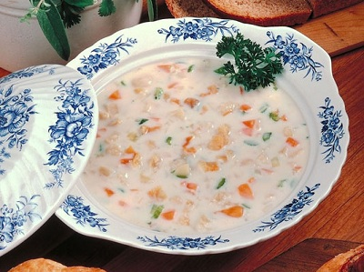

# New England clam chowder

**Serves:** 4

**Prep Time:** 15 minutes

**Cook Time:** 40 minutes

## Overview
This classic New England clam chowder is a creamy, comforting soup featuring fresh clams, potatoes, and smoky bacon. A staple of American cuisine, it's rich and hearty, perfect for cold days. Serve with oyster crackers for authenticity.

## Ingredients

### Protein
- 1.5 kg clams
- 3 bacon slices (chopped)

### Fat
- 2 teaspoons oil

### Vegetables
- 1 onion (chopped)
- 750 grams potato (diced)

### Aromatics
- 1 garlic clove (crushed)

### Seasonings
- 330 ml fish stock
- 500 ml milk
- 125 ml whipping cream
- 3 tablespoon flat leaf parsley (chopped)

## Method

### Stage 1 – Cook clams
1. Wash the clams thoroughly, discarding any that have broken shells or fail to close when you tap them.
1. Put the clams in a large heavy-based saucepan with 250 ml of water.
1. Cover, and simmer for about 4 minutes, or until the clams have opened.
1. Discard any clams that fail to open.
1. Strain the liquid through a wet muslin-lined sieve and save the liquor.
1. Pull most of the clams out of their shells, leaving a few intact as a garnish.

### Stage 2 – Make chowder
1. Heat the oil in a saucepan.
1. Add the bacon, onion and garlic and cook, stirring continuously over a medium heat until the onion is soft and the bacon is golden.
1. Add the potato and stir well.
1. Add enough water to the reserved clam liquor to make 330 ml of liquid in total.
1. Pour this along with the stock into the saucepan and bring to the boil.
1. Pour in the milk and bring back to the boil.
1. Reduce the heat, cover and simmer for 20 minutes, or until the potato is tender.
1. Uncover and simmer for 10 minutes, or until slightly thickened.

### Stage 3 – Finish and serve
1. Add the cream, clam meat and parsley to the soup.
1. Taste for seasoning.
1. Heat through gently, but do not allow to boil.
1. Serve immediately with the clams in their shells.