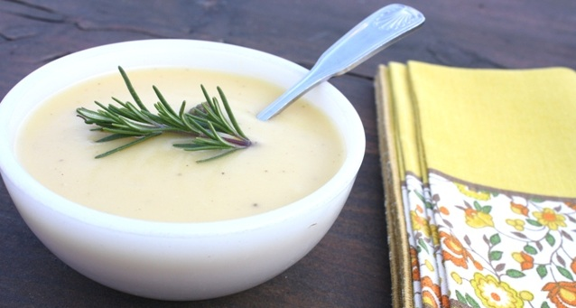

# Potato and garlic soup

**Serves:** 6

**Prep Time:** 15 minutes

**Cook Time:** 50 minutes

## Overview
A rustic, comforting soup highlighting the sweet, nutty flavor of roasted garlic combined with creamy potatoes. Pureed for smoothness, it's a simple yet flavorful dish perfect for garlic lovers.

## Ingredients

### Base
- 2 tablespoons olive oil

### Aromatics
- 1 onion (finely chopped)
- 2 onions (halved)
- 2 garlic bulbs (cloves separated and peeled)

### Vegetables
- 500 grams potatoes (peeled and cubed)

### Liquid/Broth
- 2 litres stock (vegetable or chicken)

### Garnishes
- chopped chives to serve (or a sprig of rosemary)

## Method

### Stage 1 – Prepare ingredients
1. Separate the garlic bulbs into cloves and gently crush with the flat side of a knife to split the skin.
2. Peel the cloves and cut in half.
3. Chop the potatoes into small cubes.

### Stage 2 – Cook soup
1. Heat the olive oil in a large frying pan, add the onion and garlic and cook over a medium-low heat for 5 - 10 minutes, or until the garlic is very lightly golden.
2. Add the potato and cook over a low heat for 5 minutes.
3. Add the stock and simmer for 40 - 45 minutes, or until the garlic is very soft and the stock has reduced. Set aside to cool slightly.

### Stage 3 – Puree and serve
1. Process the soup in batches in a food processor until smooth.
2. Return to the pan and taste for seasoning.
3. Reheat gently before serving, and serve with a sprinkle of chopped chives.

## Notes
- **Garlic:** Roast gently to avoid bitterness; it should be soft and sweet.
- **Potatoes:** Use starchy potatoes like Russet for creaminess.
- **Pureeing:** Blend in batches for safety; hot liquid expands.
- **Stock:** Vegetable stock keeps it vegetarian; chicken adds richness.

## Serving
Serve hot with crusty bread and a sprinkle of chives or rosemary.

## Storage
- Refrigerate up to 3 days; reheat gently.
- Freezes well for up to 2 months.
- Best eaten fresh; flavors deepen overnight.