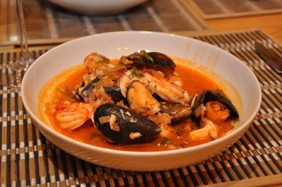

# Seafood soup

**Serves:** 4 - 6

**Prep Time:** 30 minutes

**Cook Time:** 50 minutes

## Overview
A hearty Mediterranean seafood soup featuring a variety of fresh shellfish and fish in a rich tomato broth infused with wine, garlic, and herbs. The homemade fish stock provides deep flavor, making it a luxurious one-pot meal.

## Ingredients

### Base
- 60 ml olive oil

### Aromatics
- 3 onions (finely chopped)
- 6 garlic cloves (crushed)
- 1 leek (finely sliced)

### Vegetables
- 4 tomatoes
- 60 grams tomato purée

### Protein
- 500 grams raw king prawns (whole)
- 1 raw lobster tail
- 2 fish heads
- 500 grams white fish fillet (cut into small pieces)
- 12 mussels (firmly closed)
- 200 grams scallops with corals

### Seasonings
- 3 bay leaves
- small piece orange rind
- 30 grams fresh parsley (chopped)
- 30 grams fresh basil (chopped)

### Liquid/Broth
- 250 ml red wine
- 500 ml water

## Method

### Stage 1 – Prepare seafood and vegetables
1. Scrub the mussels thoroughly, removing the beards and discarding any that have broken shells or fail to close when you tap them. Set aside.
2. Score a cross in the base of each tomato, and place into a pan of boiling water for 1 minute. Remove and plunge into a bowl of ice cold water, drain and peel away the skins.

### Stage 2 – Make fish stock
1. To make the fish stock, peel and de-vein the prawns and set the shells, heads and tails aside.
2. Shell the lobster tail, and chop the meat. Set the shell aside.
3. Put the lobster shell, fish heads, prawn shells, heads and tails in a large pan.
4. Add the wine, 1 onion, 2 cloves of garlic, 1 bay leaf along with 500 ml water.
5. Bring to the boil, and immediately reduce the heat and simmer gently for 20 minutes.
6. Strain through a chinois or fine-meshed conical sieve, reserving the stock.

### Stage 3 – Cook soup base
1. Heat the oil in a large, heavy-based pan.
2. Add the leek and remaining onion and garlic.
3. Cover and simmer, stirring occasionally over a low heat for 20 minutes, or until browned.
4. Add the tomato, remaining bay leaves, tomato paste and orange rind, stirring well.
5. Cook for 10 minutes, stirring occasionally.
6. Add the reserved fish stock, bring to the boil, reduce the heat and simmer for 10 minutes, stirring occasionally.

### Stage 4 – Add seafood and finish
1. Add the prawns, lobster, fish pieces, mussels and scallops.
2. Simmer, covered for 4 - 5 minutes.
3. Discard any unopened mussels along with the rind and the bay leaves.
4. Add the herbs, and season to taste with salt and freshly ground black pepper.

## Notes
- **Seafood:** Use fresh; discard unopened mussels.
- **Stock:** Homemade adds depth; substitute with store-bought if needed.
- **Orange rind:** Adds subtle citrus; remove before serving.
- **Timing:** Don't overcook seafood; it should be just done.

## Serving
Serve hot with crusty bread to soak up the broth.

## Storage
- Refrigerate up to 1 day; seafood doesn't reheat well.
- Not suitable for freezing.
- Best eaten fresh.