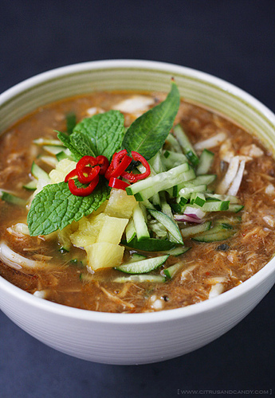

# Shellfish Laksa

*A laksa is a soupy Malaysian strew of fish, poultry, meat or vegetables with noodles. Laksas are often very hot and are cooled by adding coconut milk.*

**Serves:** 4

**Prep Time:** 20 minutes

**Cook Time:** 20 minutes

## Overview
A fragrant Malaysian noodle soup combining shellfish with a spicy coconut curry broth, rice noodles, and fresh herbs. The balance of heat from chillies and creaminess from coconut milk makes it a comforting yet exotic dish.

## Ingredients

### Base
- 45 ml groundnut oil

### Aromatics
- 5 garlic cloves
- 1½ tablespoon chopped fresh root ginger
- 7 small red shallots
- 2 fennel bulbs (cut into thin wedges)

### Protein
- 450 grams white fish fillet
- 20 large prawns (peeled and de-veined)

### Seasonings
- 3 fresh medium hot red chillies (de-seeded and chopped)
- 1 teaspoon mild paprika
- 2 teaspoon shrimp paste
- 1 teaspoon fennel seeds (crushed)
- 45 ml Thai fish sauce
- juice of 1 - 2 limes
- 25 grams fresh coriander (with roots)
- small bunch fresh basil

### Liquid/Broth
- 600 ml fish stock
- 450 ml coconut milk

### Other
- 300 grams thin vermicelli rice noodles
- 2 spring onions (finely sliced)

## Method

### Stage 1 – Make spice paste
1. Process the chillies, garlic, paprika, shrimp paste, ginger and two of the shallots to a paste in a food processor.
2. Remove the roots and stems from the coriander, wash and pat dry with kitchen paper.
3. Add them to the paste.
4. Chop and reserve the coriander leaves.
5. Add 1 tablespoon of oil to the paste and process again until fairly smooth.
6. Scrape into a bowl.

### Stage 2 – Cook aromatics
1. Heat the remaining oil in a large pan.
2. Add the remaining shallots, with the fennel seeds and fennel wedges.
3. Cook until lightly browned, then add 3 tablespoons of the paste and stir-fry for 1 - 2 minutes.

### Stage 3 – Build broth
1. Pour in the fish stock and bring to the boil.
2. Reduce the heat to low and simmer for 8 - 10 minutes.
3. Meanwhile, cook the vermicelli rice noodles, drain thoroughly and set aside.
4. Pour the coconut milk into the pan, stirring constantly to prevent sticking, then add the juice of 1 lime with 2 tablespoons of the fish sauce.
5. Stir well to combine, and bring to a gentle simmer.
6. Taste for seasoning, adding more coconut milk, lime juice or fish sauce as necessary.

### Stage 4 – Add protein and finish
1. Add the fish to the pan.
2. Cook for 2 - 3 minutes, then add the raw prawns and cook for a further 3 - 4 minutes or until they just turn pink.
3. Chop most of the basil and add it to the pan with the reserved coriander leaves.
4. Divide the noodles among 4 - 5 deep bowls, then ladle in the stew.
5. Sprinkle with spring onions and the remaining whole basil leaves.
6. Serve at once.

## Notes
- **Shrimp paste:** Adds umami; use sparingly as it's pungent.
- **Spice level:** Adjust chillies for heat; coconut milk balances it.
- **Noodles:** Cook just before serving to avoid sogginess.
- **Fresh herbs:** Add at end for brightness.

## Serving
Serve hot in bowls with noodles. Adjust spice with extra chillies.

## Storage
- Refrigerate up to 1 day; noodles absorb broth.
- Not suitable for freezing.
- Best eaten fresh.