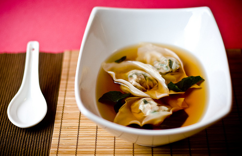

# Wuntun soup

*This is one of the most popular soups in southern China, and is equally popular in Chinese restaurants in the West. Ideally, soup wuntun should be stuffed savoury dumplings poached in clear water then served in a rich broth.*

**Serves:** 4 - 6

**Prep Time:** 20 minutes

**Cook Time:** 10 minutes

## Overview
A comforting Chinese soup featuring delicate pork-filled wontons poached and served in a clear chicken broth, garnished with soy sauce and sesame oil for authentic flavor.

## Ingredients

### Protein
- 350 grams minced pork

### Seasonings
- 1 tablespoon light soy sauce (for filling)
- 2 teaspoons dry sherry
- 1 ½ tablespoons spring onions (finely chopped, for filling)
- 1 teaspoon sesame oil (for filling)
- 1 egg white
- ½ teaspoon cornflour
- 1 teaspoon sugar
- ½ teaspoon salt

### Liquid/Broth
- 1 litre Chinese chicken stock

### Other
- 30 wuntun skins

### Garnishes
- 1 tablespoon light soy sauce
- 1 tablespoon spring onions (finely chopped)
- 1 teaspoon sesame oil

## Method

### Stage 1 – Make filling and assemble wontons
1. Combine the filling ingredients in a large bowl and mix well.
2. Using a small spoon, put a small amount of filling in the centre of each wuntun skin.
3. Bring up the sides of the skin around the filling and pinch them together at the top so that the wuntun is well sealed. It should look like a small, filled bag.

### Stage 2 – Poach wontons
1. Bring a large pot of water to the boil and place the wuntun in the water for 1 minute until they float to the top.
2. This poaching rids the wuntun of any excess flour and starch and will ensure that the soup itself is clean and has a clean texture.
3. Remove the wuntun with a slotted spoon and put them on a plate.

### Stage 3 – Make soup and serve
1. Bring the chicken stock to the boil in a large pot.
2. Add the cooked wuntun and the garnish ingredients.
3. Turn the heat to low and simmer for 2 minutes.
4. Serve in individual bowls.

## Notes
- **Wontons:** Seal tightly to prevent bursting; poach to remove starch.
- **Filling:** Mix well for binding; don't overfill.
- **Broth:** Use good quality stock for clarity.
- **Garnish:** Add at end for freshness.

## Serving
Serve hot in bowls with extra soy sauce on the side.

## Storage
- Refrigerate wontons up to 1 day; broth separate.
- Freezes well for up to 1 month.
- Best assembled fresh.