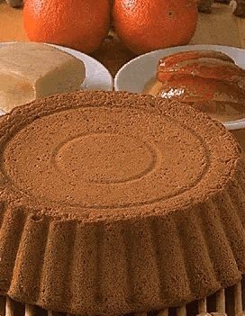

# Biscuit à L'Orange

*This elegant sponge can be served either as a complete cake or divided into individual biscuits, bringing citrus brightness and delicate almond character to refined desserts.*

**Prep Time:** 20 minutes
**Cook Time:** 25 minutes
**Yield:** 1 cake (22-25 centimeter ring, 8 servings) or multiple individual cakes

## Overview

Biscuit à l'Orange is an elegant French almond-based sponge enriched with fresh orange zest and candied orange peel, creating a subtly citrus-flavored, tender crumb. The technique combines aeration (ribboned egg yolks with sugar, whipped whites), ground almonds and candied peel for character, and gentle folding of flour to preserve airiness. The result is a tender, fragrant sponge with whisper-thin crumb and pronounced orange flavor, perfect as a complete layered cake or divided into individual portions for plated desserts. Success depends on achieving proper ribbon consistency, meticulous folding technique, careful spreading of the batter into the ring, and precise baking at moderate temperature.

## Ingredients

### Egg & Sugar Base
- 4 large eggs, size 4 (separated into yolks and whites, approximately 75 grams yolks, 120 grams whites)
- 1 additional large egg, size 2 (approximately 50 grams, used as yolk only, or divided as needed)
- 130 grams caster sugar (divided: 3/4 with yolks, 1/4 with whites)

### Almond & Citrus Flavoring
- 85 grams ground almonds (finely ground)
- 1 medium orange (zest finely chopped, approximately 10 grams)
- 25 grams candied orange peel (finely chopped)

### Flour & Fat
- 85 grams cake flour or soft flour (sifted)
- 1 teaspoon unsalted butter (melted, for greasing ring)
- 30 grams unsalted butter (for greasing tin, optional)
- 1 pinch flour (for dusting greased tin)

### Pan Setup
- 22-25 centimeter ring or springform cake tin
- Baking parchment or greaseproof paper

## Method

### Stage 1 – Prepare Tin & Parchment
1. Preheat the oven to 200°C (390°F).
1. Brush the inside of a 22-25 centimeter ring or springform tin with the 1 teaspoon melted butter.
1. Lightly coat with flour, tapping out any excess.
1. Place the ring on a baking sheet lined with parchment paper or buttered and floured greaseproof paper.
1. Ensure the ring is level and stable on the baking sheet.

### Stage 2 – Prepare Citrus Ingredients
1. Zest 1 medium orange very finely (use only the colored zest, not the white pith, approximately 10 grams zest).
1. Finely chop the candied orange peel into small pieces (approximately 5mm or smaller).
1. Measure the ground almonds and flour separately; sift the flour.

### Stage 3 – Ribbon Egg Yolks with Sugar & Flavorings
1. Separate 4 eggs plus an additional egg, placing yolks in one bowl and whites in another (ensure no yolk contaminates whites).
1. You should have approximately 5 egg yolks total and 4 egg whites total (adjust using partial additional egg as needed).
1. Place all yolks (approximately 5 total) and 3/4 of the 130 grams sugar (approximately 97 grams) in the yolk bowl.
1. Add the 85 grams ground almonds, chopped orange zest, and chopped candied orange peel.
1. Beat with an electric mixer until the mixture becomes very pale, light, and forms a ribbon when the whisk is lifted.
1. This should take approximately 8-10 minutes of beating.
1. The yolk mixture should feel thick and mousse-like with noticeably increased volume.

### Stage 4 – Whip Egg Whites
1. In a separate, scrupulously clean bowl, place the 4 egg whites.
1. Using a clean mixer or whisk, beat the whites until soft peaks form.
1. Gradually add the remaining 1/4 of the sugar (approximately 33 grams), continuing to beat at slightly higher speed.
1. Beat for exactly 1 minute after the sugar has been added.
1. The whites should become very stiff with firm, glossy peaks forming.

### Stage 5 – Fold Whites into Yolk Mixture
1. Using a flat, slotted spoon or rubber spatula, fold one-third of the whipped whites into the yolk-almond mixture until thoroughly blended.
1. Gently fold in the remaining whites all at once using a gentle J-stroke folding motion.
1. Take care not to over-fold (over-mixing deflates the whites).
1. Stop as soon as the color is uniform and no white streaks remain.

### Stage 6 – Fold in Flour
1. Just before the whites are completely incorporated (some fine white streaks are still visible), sift the 85 grams flour directly over the mixture.
1. Gently fold in the flour using the same folding technique.
1. Mix continuously but gently until the flour is completely amalgamated.
1. Stop immediately when the flour is incorporated; over-mixing creates a heavy, dense sponge.

### Stage 7 – Fill Ring
1. Gently pour the sponge mixture into the prepared ring.
1. Use a pastry scraper or palette knife to level the surface, smoothing gently (do not compress the batter, maintain airiness).
1. The batter should reach the top of the ring evenly.

### Stage 8 – Bake
1. Immediately place the baking sheet with the ring-framed sponge into the preheated 200°C oven.
1. Bake for exactly 25 minutes.
1. The sponge is done when a toothpick inserted into the center comes out clean or with just a faint moist crumb (not wet with batter).
1. The top should be pale golden, not browned (browning indicates over-baking).

### Stage 9 – Unmould & Cool
1. Remove the baking sheet from the oven.
1. As soon as the sponge is cooked, carefully remove the ring from around the sponge (the ring is hot, use a kitchen towel for protection).
1. Invert the sponge onto a wire rack and carefully peel off the parchment paper.
1. Allow to cool completely on the wire rack (approximately 1-1.5 hours).

### Stage 10 – Rest & Storage
1. Once completely cooled, wrap the sponge in cling film or place in an airtight container.
1. Allow to rest at room temperature for at least 4-6 hours, or preferably overnight.
1. Overnight resting improves texture and makes the sponge easier to slice or portion.

## Notes
- **Orange Zest Freshness:** Use fresh orange zest only (the colored part, not white pith). Avoid bottled zest.
- **Candied Peel Quality:** Fine-quality candied orange peel is essential. Cheap versions are tough and overly sweet.
- **Ribbon Consistency Essential:** Yolks must achieve ribbon stage for proper aeration and structure.
- **Folding Technique:** This sponge requires careful folding to maintain the aerated structure. Minimize mixing.
- **Flour Folding Late Stage:** Flour is added after whites are mostly incorporated to minimize over-mixing.
- **Ring Removal While Warm:** Remove the ring while the sponge is still warm (easier removal); allow to cool afterward.
- **Overnight Resting:** Improves texture and makes slicing easier. This is not optional for best results.
- **Almond Character:** Ground almonds provide both flavor and tender crumb. This is not substitutable.

## Variations
- **Lemon Version:** Substitute lemon zest and candied lemon peel for orange (same quantities).
- **Without Candied Peel:** Omit candied peel; use 15 grams additional fresh zest for stronger fresh citrus character.
- **Individual Cakes:** Pour into muffin-sized rings or tins; reduce baking time to 12-15 minutes.

## Serving
- **As Complete Cake:** Serve sliced with crème Chantilly, pastry cream, or light cream
- **With Citrus Glaze:** Drizzle with orange-flavored icing or glaze
- **Plated Dessert:** Divide into portions; serve with fresh orange sections and citrus cream
- **Accompaniment:** Pairs with orange-based sauces or coulis

## Storage
- **Room Temperature:** 1 day in an airtight container (after 24-hour resting)
- **Refrigeration:** 3-4 days wrapped well
- **Freezing:** Up to 1 month (wrap very well; thaw at room temperature)
- **Best Quality:** 12-36 hours after baking (achieved during overnight resting period)