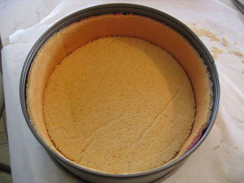

# Biscuit Joconde

*Biscuit joconde is a very fine, delicate sponge used as the base for all kinds of mousse and bavarois desserts, providing an elegant, thin, tender backdrop for creamy fillings.*

**Prep Time:** 20 minutes
**Cook Time:** 2-3 minutes
**Yield:** 1 sheet cake (baked on parchment; portioned as desired)

## Overview

Biscuit joconde is the apotheosis of French patisserie elegance: a delicate, paper-thin sponge made with tant pour tant (equal parts ground almonds and icing sugar), providing refined texture and subtle almond undertone without wheat flour heaviness. The technique combines aeration (ribboned whole eggs with tant pour tant) with careful folding of whipped egg whites, melted butter, and a modest flour addition. The result is spread thinly (3-4 millimeters) on parchment and baked very briefly (2-3 minutes at 250°C) to create a sponge that is just set and firm to the touch, not dried out. This delicate sponge serves as the structural base for mousse cakes, bavarois towers, and refined layer desserts. Success depends on achieving perfect ribbon consistency, meticulous folding technique, precise spreading thickness, and split-second baking timing.

## Ingredients

### Almond-Based Foundation
- 375 grams tant pour tant (equal parts ground almonds and icing sugar, finely sifted together)

### Egg Components
- 5 whole eggs (room temperature)
- 5 egg whites (room temperature)
- 25 grams granulated or caster sugar

### Flour & Fat
- 50 grams cake flour or soft flour (sifted)
- 40 grams unsalted butter (melted and cooled)
- 30 grams unsalted butter (for greasing baking sheet, optional)

## Method

### Stage 1 – Prepare Parchment & Equipment
1. Line a baking sheet (approximately 40 x 60 centimeters or 18 x 26 inches) with parchment paper.
1. Have a piping bag or palette knife ready for spreading.

### Stage 2 – Whisk Whole Eggs with Tant Pour Tant (Primary Aeration)
1. Place 5 whole eggs and 375 grams tant pour tant in the bowl of an electric mixer.
1. Beat at high speed for approximately 10 minutes.
1. The mixture should become pale, thick, and ribboned (when the whisk is lifted, the mixture falls in ribbons on the surface).
1. Volume will increase noticeably.
1. This is the primary aeration step for the biscuit.

### Stage 3 – Whip Egg Whites (Secondary Aeration)
1. In a separate, scrupulously clean bowl (any fat will prevent whipping), place 5 egg whites.
1. Using a clean mixer or whisk, beat the egg whites until soft peaks form.
1. Add 25 grams sugar and beat at high speed for exactly 1 minute.
1. The whites should become very stiff and glossy peaks forming.
1. Do not overbeat (grainy texture indicates over-beating).

### Stage 4 – Fold Whites into Yolk Mixture
1. Using a flat slotted spoon or rubber spatula, fold approximately one-third of the whipped whites into the ribboned egg-tant pour tant mixture.
1. Blend thoroughly but gently.
1. Add the remaining whites all at once.
1. Fold extremely gently, using a J-stroke folding motion (scrape down the sides, fold up and over).
1. Stop as soon as color is uniform and no white streaks remain (over-folding deflates the foam).

### Stage 5 – Add Butter & Flour
1. Using the flat spoon or spatula, fold the cooled 40 grams melted butter into the mixture.
1. It may seem to tighten slightly as butter incorporates, this is normal.
1. Fold just until distributed evenly.
1. Sift the 50 grams flour directly over the mixture.
1. Fold the flour in very gently (this is the last step before baking; minimal mixing prevents deflation).

### Stage 6 – Spread on Parchment
1. Immediately transfer the batter to the parchment-lined baking sheet.
1. Using a palette knife (offset spatula), spread the batter evenly to a thickness of approximately 3-4 millimeters.
1. The thickness is critical, too thin and the sponge breaks apart too easily; too thick and it loses its characteristic delicacy.
1. Spread quickly before the batter deflates from standing.

### Stage 7 – Bake at Very High Temperature
1. Immediately place into a preheated oven at 250°C (480°F).
1. Bake for exactly 2-3 minutes (the brief time is essential).
1. Do not open the oven door to check; the biscuit bakes very quickly.
1. Watch through the oven window if possible.

### Stage 8 – Test for Doneness
1. At the 2-minute mark, touch the sponge gently with your fingertips.
1. It should feel just firm and set, not sticky, but still be moist and tender (not dry).
1. The surface should not be browned; it should remain pale or have just the slightest golden tint.
1. If damp to the touch, bake an additional 30 seconds and test again.

### Stage 9 – Cool on Parchment
1. Remove the baking sheet from the oven and place on a wire rack.
1. Allow the sponge to cool completely (approximately 15-20 minutes) while still on the parchment and baking sheet.
1. Do not remove the parchment until the sponge has cooled completely (removal of warm sponge tears it).

### Stage 10 – Storage Until Use
1. Once completely cooled, the parchment-backed sponge can be left on the parchment until needed.
1. If storing before use, cover loosely with cling film or place in an airtight container.
1. Use within 1-2 days of baking for best texture.
1. When ready to use, peel the parchment away very carefully (sponge is delicate) and cut, layer, or crumble as desired for your mousse cake or dessert assembly.

## Notes
- **Tant Pour Tant Critical:** Equal-part ground almonds and icing sugar. Sift together finely. Do not substitute with almond flour alone.
- **Ribbon Consistency Essential:** The whole egg mixture must achieve ribbon stage for proper aeration. Weak aeration produces dense, heavy sponge.
- **Folding Technique Delicate:** This sponge requires more careful folding than other recipes. Minimize mixing to preserve the aerated foam structure.
- **Baking Temperature Very High:** 250°C is essential. Lower temperatures produce overly thick, cake-like results. Higher risk of burning.
- **Baking Duration Critical:** 2-3 minutes only. Longer baking dries out the delicate sponge. Watch carefully.
- **Touching Sponge for Doneness:** The touch test is more reliable than appearance. Just firm yet moist is correct.
- **Cool on Parchment:** Do not remove parchment until cool; the sponge is too delicate when warm.
- **Pale Golden Color:** This is correct. Any significant browning indicates over-baking.

## Variations
- **With Liqueur:** Add 5 millilitres liqueur (Cointreau, Grand Marnier, rum) to the whole egg mixture for flavored sponge.
- **Citrus Variation:** Add zest of 1 lemon or orange to the whole egg mixture.
- **No-Almond Version:** Substitute 375 grams tant pour tant with 250 grams flour + 125 grams icing sugar sifted together (different character but similar technique).

## Serving
- **Primary Use:** Structural base for mousse cakes, bavarois layered desserts
- **Cutting Tip:** Use a sharp, wet knife; wipe between cuts
- **Texture:** Delicate, tender, absorbs light moisture from fillings
- **Pairing:** Pairs with any mousse, cream, or filling-based dessert

## Storage
- **Room Temperature:** 1 day in an airtight container (best fresh)
- **Refrigeration:** 2-3 days wrapped well
- **Freezing:** Up to 2 weeks (freeze on parchment; thaw at room temperature before use)
- **Best Use:** Within 24 hours of baking for optimal delicacy