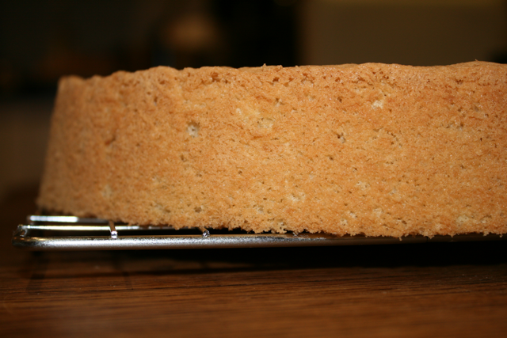

# Génoise Sponge

*The classic French butter sponge, Génoise is baked the day before serving, creating a tender, fine crumb that pairs beautifully with cream fillings, fruit, or traditional and chocolate trifles.*

**Prep Time:** 15 minutes
**Cook Time:** 30 minutes
**Yield:** 1 sponge cake (size varies by mould used)

## Overview

Génoise (Génoise nature) is the foundational French sponge cake, distinguished by its technique of warming sugar and eggs in a bain-marie to create volume, then folding in flour and clarified butter with extreme care to maintain airiness. Unlike American sponges relying on chemical leavening, Génoise relies entirely on mechanical aeration, the whisking of warm eggs creates the structural matrix that rises in the oven. Success depends on achieving proper ribbon consistency during whisking (mixture should fall in ribbons when the whisk is lifted), gently folding flour without deflating the egg foam, and using clarified butter (which incorporates better than whole butter, which contains water and milk solids that break the foam). The result is a tender, elegant sponge with fine, even crumb and delicate flavor, the perfect canvas for cream fillings, soaked syrups, or fruit accompaniments. Baking the day before serving improves texture; the sponge continues to set overnight.

## Ingredients

### Base Sponge
- 250 grams granulated sugar
- 8 large eggs (room temperature preferred)
- 250 grams cake flour or soft flour (sifted)

### Fat
- 50 grams clarified butter (melted and cooled to room temperature)
- 30 grams unsalted butter (for greasing moulds)
- 1 pinch additional flour (for coating greased moulds)

### Equipment & Pan Notes
- Bain-marie setup (bowl over simmering water, not touching water)
- Electric mixer or whisk
- 22-centimeter round cake tin, or other sized moulds as desired
- Parchment paper optional

## Method

### Stage 1 – Prepare Equipment
1. Preheat oven to 190°C (375°F).
1. Lightly butter the inside of a 22-centimeter round cake tin or desired mould.
1. Dust the buttered tin with flour, coating the sides and bottom evenly.
1. Tap out excess flour.
1. Line the bottom with parchment paper (optional but helpful for easy removal).

### Stage 2 – Prepare Clarified Butter
1. Ensure 50 grams clarified butter is melted and cooled to room temperature.
1. Clarified butter should be clear, with no milk solids at the bottom (if using whole butter, melt it, allow to rest, then carefully pour off the clear liquid, discarding the milky residue).

### Stage 3 – Warm Eggs & Sugar (Bain-Marie)
1. Place 250 grams sugar and 8 whole eggs into the bowl of an electric mixer.
1. Set the mixer bowl over a pot of gently simmering water (bain-marie setup), ensuring the bottom of the bowl does not touch the water.
1. Whisk by hand or with a mixer paddle, stirring constantly, until the mixture reaches approximately 30°C (warm to the touch, approximately body temperature).
1. This warming dissolves the sugar and helps incorporate air.
1. The mixture should feel smooth and slightly warm (about 1-2 minutes of heating).

### Stage 4 – Whisk to Ribbon Stage (Primary Aeration)
1. Remove the bowl from the bain-marie.
1. Using an electric mixer at medium speed, beat the warm mixture for 10 minutes.
1. The mixture should become pale, light, and significantly increased in volume (approximately 4-5 times the original volume).
1. When the whisk is lifted, the mixture should fall in ribbons that remain visible on the surface for a few seconds before sinking in.
1. This ribbon consistency is essential; it indicates proper aeration.

### Stage 5 – Cool & Continue Whisking
1. Reduce mixer speed to low.
1. Continue beating for a further 10 minutes as the mixture cools.
1. During this second 10-minute period, the volume stabilizes and the mixture reaches room temperature.
1. The final mixture should be very pale, thick, and have a mousse-like consistency.

### Stage 6 – Fold in Flour
1. Sift the 250 grams flour directly over the mixture.
1. Using a flat slotted spoon or rubber spatula, fold the flour in gently and carefully.
1. Do not stir or beat; use a gentle folding motion (scrape spatula along the bottom, then fold up and over).
1. Fold just until the flour is no longer visible, take care not to overwork (over-folding deflates the egg foam).
1. A few very fine streaks of flour are acceptable; stop immediately when incorporated.

### Stage 7 – Add Clarified Butter
1. Add the 50 grams cooled clarified butter.
1. Gently fold it in using the same careful folding technique.
1. The mixture may seem slightly to tighten as the butter incorporates, this is normal.
1. Fold just until the butter is distributed evenly; do not overmix.

### Stage 8 – Bake
1. Immediately divide the mixture between the prepared moulds or pour into the lightly buttered and floured tin.
1. For a 22-centimeter round tin, pour all the mixture into the single tin.
1. Bake immediately in the preheated 190°C oven.
1. Cooking time varies according to the size and shape of the mould:
   - A 22-centimeter round sponge: approximately 30 minutes
   - A very large sponge (25-30 centimeters): approximately 45-60 minutes
   - Smaller individual cakes: approximately 15-20 minutes
1. The sponge is done when a toothpick inserted into the center comes out clean or just barely moist (not wet with batter).

### Stage 9 – Unmould & Cool
1. As soon as the sponge is cooked, invert it onto a wire rack.
1. Remove the tin immediately while still warm (leaving it on too long creates condensation that softens the bottom).
1. Let the sponge cool completely on the wire rack.
1. To prevent the sponge from sticking to the rack or developing a flat spot, rotate it one-quarter turn every 15 minutes until fully cooled (approximately 1-1.5 hours total cooling time).

### Stage 10 – Rest (Important)
1. Once cooled, wrap the sponge in cling film or place in an airtight container.
1. Allow the sponge to rest at room temperature for at least 4-6 hours, or preferably overnight (24 hours).
1. Overnight resting improves the texture, making the sponge softer, more supple, and easier to slice without crumbling.

## Notes
- **Bain-Marie Warming Critical:** Warming the eggs to 30°C helps reduce foaming time and creates better aeration. Do not overheat (above 35°C may cook egg proteins unevenly).
- **Ribbon Consistency Essential:** The ribbon stage indicates proper aeration. Without it, the sponge will be dense and heavy.
- **Cooling During Second Whisking:** The second 10-minute whisking as the mixture cools stabilizes the foam structure. Do not skip this stage.
- **Flour Folding Technique:** Over-folding deflates the foam. Use gentle folding (not stirring). A few fine flour streaks are acceptable; stop immediately when mixed.
- **Clarified Butter Only:** Whole butter contains water that breaks the foam structure. Clarified butter incorporates without deflating.
- **Immediate Baking:** Batter loses aeration over time. Bake immediately after preparing.
- **Overnight Resting:** Allows the sponge structure to set and improves tenderness. This is not optional for best results.
- **Rotation During Cooling:** Helps prevent sticking and flat spots. Use a quarter-turn every 15 minutes.
- **Chocolate Variation:** Replace 50 grams flour with high-quality cocoa powder for chocolate Génoise.

## Variations
- **Chocolate Génoise:** Substitute 50 grams flour with 50 grams unsweetened cocoa powder (sift cocoa before folding in).
- **Flavored Génoise:** Add 1-2 teaspoons vanilla extract, lemon zest, or almond extract with the butter.
- **Mocha Génoise:** Add 15 millilitres strong espresso cooled to the egg mixture before folding flour.

## Serving
- **Primary Use:** Base for cream-filled cakes, trifles, layered desserts
- **Slicing Tip:** Use a serrated knife with a gentle sawing motion; slice when room temperature or slightly chilled
- **Soaking:** Can be soaked with simple syrup or liqueur for added moisture
- **Cake Assembly:** Works with any cream filling (pastry cream, buttercream, whipped cream)

## Storage
- **Room Temperature:** 1 day in an airtight container (after 24-hour resting)
- **Refrigeration:** 3-4 days wrapped tightly
- **Freezing:** Up to 1 month (wrap very well before freezing; thaw at room temperature)
- **Best Quality:** 12-36 hours after baking (achieved during overnight resting period)