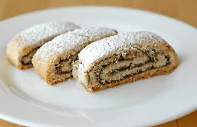

# Rolled Biscuits

*A versatile, elegant sponge sheet that can be piped or spread to any thickness and shape, then immediately inverted and filled or rolled, providing the perfect foundation for Swiss rolls, filled layer cakes, and creative pastry applications.*

**Prep Time:** 20 minutes
**Cook Time:** 6-10 minutes
**Yield:** 1 sheet cake, portioned as desired

## Overview

Rolled biscuits are the ultimate flexible sponge base, created by piping through various nozzle sizes (from 5-millimeters to 1.5-centimeters) or spreading with a palette knife to create uniform sheets of varying thicknesses. The technique combines aeration (ribboned 7 egg yolks with sugar, whipped whites), dual flour incorporation (wheat flour plus potato flour for enhanced tenderness), meticulous folding, and immediate towel inversion while warm to create a perfectly pliable, rollable sponge. The result is an elegant sheet cake that can be filled, rolled, or layered with creams, jams, or mousses. Success depends on achieving proper ribbon consistency, careful folding, precise spreading/piping, and the distinctive immediate-inversion towel technique that prevents sticking and maintains pliability.

## Ingredients

### Egg Components (7 Yolks Total)
- 4 large eggs (separated, approximately 75 grams yolks, 120 grams whites)
- 3 additional large egg yolks (approximately 60 grams, add to yolk bowl)
- 85 grams caster sugar (sifted, divided: 2/3 with yolks, 1/3 with whites)

### Flours
- 35 grams wheat flour (sifted)
- 40 grams potato flour (sifted)

### Equipment & Supplies
- Piping bag fitted with plain nozzle (various sizes possible: 5mm for thin lines, 1.5cm for thick drops)
- OR palette knife for spreading
- Baking sheet lined with parchment paper
- Kitchen towel for immediate inversion

## Method

### Stage 1 – Prepare Parchment & Equipment
1. Preheat the oven to 220°C (425°F).
1. Line a baking sheet (approximately 40 x 60 centimeters or 18 x 26 inches) with parchment paper.
1. Have a piping bag fitted with your chosen nozzle (size determines thickness and pattern), or have a palette knife ready for spreading the batter.
1. Have a clean kitchen towel ready for the immediate inversion step (critical).

### Stage 2 – Ribbon Egg Yolks with Sugar
1. Separate 4 eggs, placing yolks and whites in separate bowls (ensure no yolk contaminates whites).
1. Add 3 additional egg yolks to the yolk bowl (you should have 7 yolks total).
1. Add approximately 2/3 of the 85 grams sugar (approximately 57 grams) to the yolk bowl.
1. Beat with an electric mixer until the mixture becomes pale, light, and forms a ribbon when the whisk is lifted.
1. This ribbon stage is essential; the yolk mixture should increase noticeably in volume.
1. The final mixture should be thick and mousse-like.
1. Beating time approximately 8-10 minutes depending on mixer speed.

### Stage 3 – Whip Egg Whites
1. In a separate, scrupulously clean bowl (any fat prevents whipping), place approximately 4 egg whites (from the 4 eggs separated earlier, do NOT use the extra yolks' whites, as you don't have any from those).
1. Using a clean mixer or whisk, beat the whites until soft peaks form and they hold their shape.
1. Gradually add the remaining 1/3 of the sugar (approximately 28 grams), continuing to beat at slightly higher speed.
1. Beat for exactly 1 minute after the sugar is added.
1. The whites should become very stiff with firm, glossy peaks forming (test by tilting the bowl, whites should not flow).

### Stage 4 – Fold Whites into Yolk Mixture
1. Using a flat slotted spoon or rubber spatula, fold approximately one-third of the whipped whites into the yolk mixture.
1. Blend thoroughly but gently until the mixture is perfectly blended.
1. Add the remaining whites all at once and fold them very gently into the mixture using a gentle J-stroke folding motion.
1. Take care not to over-fold (over-mixing deflates the whites).
1. Stop as soon as the color is uniform and no white streaks remain.

### Stage 5 – Fold in Flours
1. Before the whites are completely blended (some fine white streaks still visible), sift the combined 35 grams wheat flour + 40 grams potato flour directly over the mixture.
1. Continue the gentle folding motion, incorporating the flours together.
1. Mix continuously but gently until the flours are completely incorporated.
1. Stop immediately when mixed; over-mixing creates a heavy, dense sponge.
1. The final mixture should be smooth, thick, and mousse-like.

### Stage 6a – Piping Method (for patterned, uniform drops)
1. Transfer the batter to a piping bag fitted with your chosen plain nozzle.
1. Pipe onto the parchment-lined baking sheet in your desired pattern:
   - **5-millimeter nozzle:** Creates thin, delicate lines suitable for rolled cakes
   - **1-centimeter nozzle:** Creates medium-thickness lines suitable for Swiss rolls
   - **1.5-centimeter nozzle:** Creates thick, sturdy lines suitable for layered cakes
1. Space the piped lines or drops depending on desired thickness when piping is baked.
1. For a uniform sheet 3-5 millimeters thick, pipe lines closely together to create a cohesive sheet.

### Stage 6b – Spreading Method (for smooth, uniform coverage)
1. Alternatively, use a palette knife (offset spatula) to spread the batter evenly across the parchment.
1. Spread to a uniform thickness of approximately 3-5 millimeters.
1. Use smooth, even strokes from edge to edge; do not compress (maintain airiness).
1. The thickness determines final baking time (thinner = faster baking).

### Stage 7 – Bake
1. Immediately place the baking sheet with piped or spread batter into the preheated 220°C oven.
1. Baking time varies by nozzle size or spread thickness:
   - **5-millimeter nozzle or spread:** 6-7 minutes (thin, delicate)
   - **1-centimeter nozzle or spread:** 7-8 minutes (medium)
   - **1.5-centimeter nozzle or spread:** 8-10 minutes (thick, sturdy)
1. The baked sponge should be pale golden on top with very light browning at the edges.
1. It should feel firm to the touch but still be soft and pliable (not hard or crispy).

### Stage 8 – Immediate Inversion on Towel (Critical!)
1. Remove the baking sheet from the oven immediately upon doneness.
2. Have a clean kitchen towel laid out flat and ready on your work surface.
1. Immediately (while the sponge is still hot/warm, timing is critical) invert the baked sponge onto the towel.
1. The towel is placed directly on top of the baking sheet, then both are flipped upside down together.
1. The sponge should now be sitting on the towel, with parchment on top (which you'll remove).
1. Immediately and carefully peel the parchment paper away from the bottom of the sponge (which is now on top after inversion).
1. The warm sponge is pliable and won't stick to the towel; if you delay this step, the sponge will adhere to the parchment and become difficult to separate.

### Stage 9 – Cool on Towel
1. Allow the sponge to cool completely on the towel at room temperature (approximately 20-30 minutes).
1. The towel provides the textured surface to prevent sticking, and the sponge retains its pliability as it cools.
1. Once fully cooled, the sponge can be carefully rolled, layered, cut, or portioned as desired.

### Stage 10 – Fill & Roll (if desired)
1. If creating a Swiss roll or filled roll-up:
   - Spread filling (jam, buttercream, or mousse) evenly over the cooled sponge.
   - Using the towel as a guide, roll the sponge tightly from one end, using the towel to support and guide.
   - The towel helps prevent tearing or unraveling during the rolling process.
   - Once rolled, the sponge can be chilled before serving.

## Notes
- **Seven Egg Yolks:** The extra yolks (beyond the 4-egg separation) create a richer, more tender crumb. This is intentional and not an error.
- **Potato Flour Inclusion:** The 40g potato flour (vs. wheat flour alone) creates enhanced tenderness and pliability. This is not substitutable.
- **Immediate Inversion Critical:** The towel inversion must happen while the sponge is still warm and pliable. Delayed inversion allows the sponge to firmly adhere to the parchment, making it difficult to remove, this is THE most important timing step in the entire recipe.
- **Parchment Peeling:** Peel the parchment immediately after inversion while warm (easier). If you wait until cool, it may stick and tear the sponge.
- **Piping vs. Spreading:** Both methods work equally well. Piping creates decorative line patterns but requires more skill; spreading is straightforward but requires a clean palette knife technique.
- **Nozzle Size Variation:** Choose nozzle size based on intended application and desired final thickness.
- **Rolling Support:** The towel's textured surface provides friction to prevent slipping during rolling, and its width supports the sponge during the roll-up process.

## Variations
- **Chocolate Version:** Replace 15-20 grams wheat flour with unsweetened cocoa powder (sift before folding).
- **Flavored Version:** Add 1-2 teaspoons vanilla, almond, or citrus extract to the yolk mixture.
- **Thicker Cake:** Increase spread thickness to 6-8 millimeters (extends baking time by 1-2 minutes).
- **Thinner Cake:** Reduce spread thickness to 2-3 millimeters (reduces baking time by 1-2 minutes).

## Serving
- **As Swiss Roll:** Fill with jam and whipped cream; dust with icing sugar
- **Layered Cake:** Cut into portions; layer with cream, mousse, or ganache
- **Plated Dessert:** Portion and serve with sauce, fruit, and cream accompaniments
- **Temperature:** Serve at room temperature or chilled depending on fillings and application

## Storage
- **Room Temperature:** 1 day in an airtight container (after cooling completely)
- **Refrigeration:** 2-3 days wrapped well (important if filled with cream)
- **Freezing:** Up to 2 weeks unfilled (wrap very well; thaw at room temperature)
- **Filled Cakes:** Refrigerate after assembly; consume within 2-3 days
- **Best Quality:** Fresh-baked same day or next day (texture softens with age)