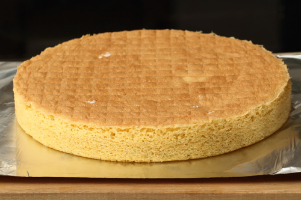

# Sponge Base

*A versatile, simple butter sponge base suitable for cakes of any diameter, providing tender crumb and balanced flavor that serves as the perfect foundation for fillings, frostings, and creative applications.*

**Prep Time:** 15 minutes
**Cook Time:** 15-25 minutes
**Yield:** 1 sponge cake (size varies by mould used)

## Overview

Sponge base is a simplified, diameter-flexible version of larger butter sponge cakes, allowing bakers to create cakes of any size using standardized proportions. The technique combines aeration (ribboned egg yolks with sugar, whipped whites), careful folding to preserve airiness, and variable baking time adjusted to mould diameter. The result is a tender, versatile sponge with balanced flavor and fine crumb, equally suited to small individual cakes, medium 22-centimeter layers, or large tortes. Success depends on achieving proper ribbon consistency, meticulous folding technique, and understanding the relationship between mould/sponge thickness and required baking time.

## Ingredients

### Egg & Sugar Base
- 6 large eggs (separated into yolks and whites, approximately 100 grams yolks, 180 grams whites)
- 190 grams caster sugar (sifted, divided: 2/3 with yolks, 1/3 with whites)

### Flour
- 180 grams cake flour or soft flour (sifted)

### Pan Setup & Diameter Notes
- Tin or flan ring of desired diameter (22-centimeter is standard; adjust baking time for other sizes)
- Parchment paper (optional but helpful)

## Method

### Stage 1 – Prepare Tin
1. Preheat the oven to 190°C (375°F).
1. Lightly butter the inside of a tin or flan ring of your chosen diameter (22-centimeter is standard; smaller diameters reduce baking time, larger diameters increase it).
1. Line the bottom with parchment paper (optional).

### Stage 2 – Ribbon Egg Yolks with Sugar
1. Separate 6 eggs into yolks in one bowl and whites in another (ensure no yolk contaminates whites).
1. Place 6 egg yolks and approximately 2/3 of the 190 grams sugar (approximately 127 grams) into the yolk bowl.
1. Beat with an electric mixer until the mixture becomes pale, light, and forms a ribbon when the whisk is lifted.
1. This ribbon stage is essential and indicates proper aeration.
1. The yolk mixture should feel thick and mousse-like with noticeably increased volume (approximately 3-4 times original).
1. Beating time approximately 8-10 minutes depending on mixer speed.

### Stage 3 – Whip Egg Whites
1. In a separate, Very clean bowl (any fat prevents whipping), place the 6 egg whites.
1. Using a clean mixer or whisk, beat the whites until soft peaks form and they hold their shape.
1. Gradually add the remaining 1/3 of the sugar (approximately 63 grams), continuing to beat at slightly higher speed.
1. Beat for exactly 1 minute after the sugar is added.
1. The whites should become very stiff with firm, glossy peaks forming.

### Stage 4 – Fold Whites into Yolk Mixture
1. Using a flat slotted spoon or rubber spatula, fold approximately one-third of the whipped whites into the yolk mixture.
1. Blend thoroughly but gently until the mixture is perfectly blended.
1. Add the remaining whites all at once and fold them very gently into the mixture using a gentle J-stroke folding motion (scrape down the side, fold up and over).
1. Take care not to over-fold (over-mixing deflates the whites).
1. Stop as soon as the color is uniform and no white streaks are visible.

### Stage 5 – Fold in Flour
1. Sift the 180 grams flour directly over the mixture.
1. Using the same folding technique, gently fold the flour in.
1. Mix continuously but gently until the flour is completely homogeneous.
1. Stop immediately when the mixture is homogeneous; over-mixing creates a heavy, dense sponge.

### Stage 6 – Pour into Tin
1. Immediately pour the mixture into the lightly buttered and floured tin or flan ring.
1. Level the surface gently with a pastry scraper or palette knife (do not compress, maintain airiness).

### Stage 7 – Bake (Variable Time by Diameter)
1. Place immediately in the preheated 190°C oven.
1. Baking time varies significantly by mould diameter and therefore sponge thickness:
   - **15-18 minutes:** Extra-large thin sponges (30+ centimeter diameter)
   - **20-25 minutes:** Standard 22-centimeter sponge (most common)
   - **12-15 minutes:** Medium-sized sponges (18-20 centimeter diameter)
   - **8-12 minutes:** Individual-sized or small cakes
1. The sponge is done when a toothpick inserted into the center comes out clean or with just a faint moist crumb (not wet with batter).
1. The top should be golden and spring back when lightly touched.

### Stage 8 – Unmould & Cool
1. As soon as cooked, invert the sponge onto a wire rack.
1. Remove the tin immediately (leaving it on creates condensation that softens the bottom).
1. If using parchment, peel it off while the sponge is still warm or completely cool (remove in the state that feels natural, either direction works).
1. Allow the sponge to cool completely on the wire rack (approximately 1-1.5 hours total).

### Stage 9 – Quarter-Turn Cooling
1. To prevent the sponge from sticking to the rack or developing a flat spot, rotate it one-quarter turn every 15 minutes during cooling.
1. This takes approximately 4 rotations over the full cooling period.
1. Continue until the sponge has cooled completely.

### Stage 10 – Rest
1. Once completely cooled, wrap the sponge in cling film or place in an airtight container.
1. Allow to rest at room temperature for at least 4-6 hours, or preferably overnight (24 hours).
1. Overnight resting improves texture and makes the sponge easier to slice and handle.

## Notes
- **Ribbon Consistency Essential:** Yolks must achieve ribbon stage for proper aeration and structure. Weak aeration produces dense sponge.
- **Folding Technique Delicate:** This is a fundamental technique. Minimize mixing to preserve aerated foam structure.
- **Baking Time Variable by Diameter:** Thinner sponges (which are wider in diameter) bake faster. Always check visually and with toothpick test rather than relying solely on time.
- **Cooling Rotation Critical:** Quarter-turns every 15 minutes prevent sticking and distribution of air bubbles evenly. This step improves texture.
- **Overnight Resting:** Improves texture significantly. This is not optional for best results.
- **Temperature & Weight:** Do not substitute room-temperature eggs for cold eggs (affects incorporation timing) or reduce quantities (affects structure).

## Variations
- **Chocolate Sponge:** Replace 30-40 grams flour with unsweetened cocoa powder (sift before folding).
- **Flavored Sponge:** Add 1-2 teaspoons vanilla, almond, or lemon extract to the yolk mixture.
- **Liqueur Addition:** Add 1-2 teaspoons liqueur (Cointreau, Grand Marnier, rum) to the yolk mixture for subtle depth.

## Serving
- **With Fillings:** Any cream, ganache, jam, or mousse filling
- **Layering:** Slice horizontally into thin layers for multi-layer cakes
- **Soaking:** Can be lightly brushed with simple syrup or liqueur before assembly
- **Temperature:** Serve at room temperature or slightly chilled, depending on filling choice

## Storage
- **Room Temperature:** 1 day in an airtight container (after 24-hour resting)
- **Refrigeration:** 3-4 days wrapped well
- **Freezing:** Up to 1 month (wrap very well before freezing; thaw at room temperature)
- **Best Quality:** 12-36 hours after baking (achieved during overnight resting period)