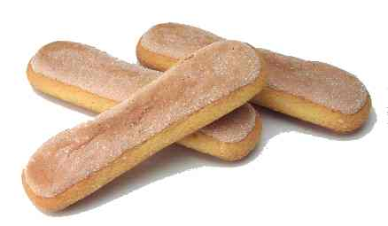

# Sponge Fingers

*Elegant sponge biscuits perfect as a base for Swiss rolls, tiramisu, or charlottes, these delicate fingers can be served dipped in crème Chantilly or arranged as decorative elements on refined desserts.*

**Prep Time:** 15 minutes
**Cook Time:** 8-10 minutes
**Yield:** Approximately 24-30 sponge fingers (1.5cm wide x 10cm long)

## Overview

Sponge fingers are the classic French biscuit à la cuillère, distinguished by their light, airy structure and characteristic finger shape created by piping through a large nozzle. The technique combines aeration (ribboned egg yolks with sugar, whipped egg white peaks), careful folding of flour added late-stage, and dual icing sugar dusting at 5-minute intervals during cooling to create a delicate, sweet exterior. The result is a tender, elegant biscuit suitable for layering in desserts (Swiss rolls, charlottes), dipping in hot chocolate or liqueurs, or serving with soft creams. Success depends on achieving proper ribbon consistency, meticulous white folding technique, precise nozzle size and piping technique, and the distinctive dual-dust finishing procedure.

## Ingredients

### Egg Components
- 6 eggs (separated into yolks and whites, approximately 90 grams yolks, 180 grams whites)
- 190 grams caster sugar (sifted, divided into 2/3 and 1/3 portions)

### Flour
- 180 grams cake flour or soft flour (sifted)

### Finishing
- 30 grams icing sugar (sifted, for dusting)

### Equipment
- Piping bag fitted with 1.5-centimeter plain round nozzle
- Baking parchment or lightly buttered and floured greaseproof paper

## Method

### Stage 1 – Prepare Parchment
1. Preheat the oven to 220°C (425°F).
1. Line baking sheets with parchment paper or lightly butter and flour greaseproof paper.
1. Have a piping bag fitted with a 1.5-centimeter plain round nozzle ready.

### Stage 2 – Ribbon Egg Yolks with Sugar
1. Separate 6 eggs into yolks and whites in two separate bowls (ensure no yolk contaminates whites).
1. Place the egg yolks and approximately 2/3 of the 190 grams sugar (approximately 127 grams) in a bowl.
1. Beat with an electric mixer or whisk until the mixture becomes pale, light, and forms a ribbon when the whisk is lifted.
1. This ribbon stage is essential; the mixture should increase noticeably in volume.
1. The yolk mixture should feel thick and mousse-like.

### Stage 3 – Whip Egg Whites
1. In a separate, very clean bowl (any fat prevents whipping), place the 6 egg whites.
1. Using a clean mixer or whisk, beat the whites until soft peaks form and they hold their shape.
1. Gradually add the remaining 1/3 of the sugar (approximately 63 grams), continuing to beat at slightly higher speed.
1. Beat for exactly 1 minute after the sugar is added.
1. The whites should become very stiff with firm, glossy peaks forming.
1. Test by tilting the bowl, the whites should not flow.

### Stage 4 – Fold Whites into Yolks
1. Using a flat slotted spoon or rubber spatula, fold approximately one-third of the whipped whites into the yolk mixture.
1. Blend thoroughly but gently until the mixture is perfectly blended.
1. Add the remaining whites all at once and fold them very gently into the mixture using a J-stroke folding motion.
1. Take care not to over-fold (over-mixing deflates the whites).
1. Stop as soon as the color is uniform and no white streaks are visible.

### Stage 5 – Fold in Flour
1. Before the whites are completely blended (some fine white streaks are still visible), sift the 180 grams flour directly over the mixture.
1. Continue the gentle folding motion, incorporating the flour.
1. Mix continuously but gently until the flour is completely incorporated (stopping as soon as it's mixed prevents over-working).
1. The final mixture should be smooth, thick, and mousse-like.

### Stage 6 – Pipe Sponge Fingers
1. Transfer the mixture to a piping bag fitted with a 1.5-centimeter plain round nozzle.
1. Pipe out 'fingers' approximately 10 centimeters long onto the parchment-lined baking sheets.
1. Space them about 2 centimeters apart (they will expand slightly).
1. Pipe approximately 24-30 fingers per standard baking sheet depending on size.
1. The piped fingers should be relatively uniform in size and thickness.

### Stage 7 – First Icing Sugar Dust
1. Immediately after piping, use a fine sieve to lightly dust the entire surface of each finger with icing sugar.
1. Dust generously but evenly, the sugar should create a light white coating over each finger.
1. Allow the dusted fingers to rest for exactly 5 minutes.

### Stage 8 – Second Icing Sugar Dust
1. After the 5-minute rest, dust the fingers a second time with icing sugar using the same method.
1. The second dust fills in any gaps left by the first and creates the characteristic sparkly finish.
1. Allow the dusted fingers to rest for another 5 minutes before baking (total 10 minutes resting time).

### Stage 9 – Bake
1. Immediately after the final resting period, place the baking sheets into the preheated 220°C oven.
1. Bake for approximately 8-10 minutes.
1. The sponge fingers should become pale golden on top with very light browning on the edges.
1. They should feel firm to the touch but still be soft (not hard or crispy, this would indicate over-baking).
1. Do not open the oven door during baking; only check at the 8-minute mark.

### Stage 10 – Cool & Serve
1. Remove from the oven as soon as baked.
1. While still warm (before they cool and harden to the rack), use a palette knife to carefully lift each finger from the parchment paper and place on a wire rack.
1. Handle gently, they are delicate when warm.
1. Allow to cool completely (approximately 20-30 minutes).
1. Once cooled, the sponge fingers can be stored in an airtight container or used immediately.

## Notes
- **Ribbon Consistency Critical:** Yolks must achieve ribbon stage for proper aeration and structure.
- **Egg White Whipping:** Any fat prevents whipping. Ensure bowl and beater are completely clean.
- **Dual-Dust Finishing:** The two icing sugar dusts create the characteristic sparkly finish and prevent sticking. Do not skip this step.
- **Timing Between Dusts:** Exactly 5 minutes between dusts allows the first coat to set slightly.
- **Nozzle Size:** 1.5-centimeter nozzle creates classic sponge finger size. Smaller nozzles create thinner, more delicate fingers; larger create sturdier fingers.
- **Immediate Removal from Paper:** Remove from parchment while warm but cool enough to handle; they stick to paper when cool.
- **Flour Folding Late Stage:** Flour is added after whites are mostly incorporated to minimize over-mixing.
- **Baking Temperature:** 220°C is correct for the pale golden color and light texture.

## Variations
- **Chocolate Fingers:** Replace 30 grams flour with 30 grams unsweetened cocoa powder (sift before folding).
- **Flavored Fingers:** Add 1-2 teaspoons vanilla extract, almond extract, or 1 teaspoon lemon zest to the yolk mixture.
- **Larger Nozzle:** Use 2-centimeter nozzle for thicker, sturdier fingers suitable for dipping.

## Serving
- **Swiss Rolls:** Serve as base for filled and rolled cakes
- **Tiramisu:** Layer with mascarpone cream and espresso
- **Dipping:** Perfect for dipping in hot chocolate, coffee, or Marsala wine
- **Charlotte:** Layer vertically as the structure for layered desserts

## Storage
- **Airtight Container:** 3-4 days at room temperature (important to keep airtight, they soften if exposed to air)
- **Refrigeration:** 5-7 days in sealed container
- **Freezing:** Up to 1 month in freezer-safe container
- **Best Quality:** 1-2 days after baking (texture is crispest when fresh)