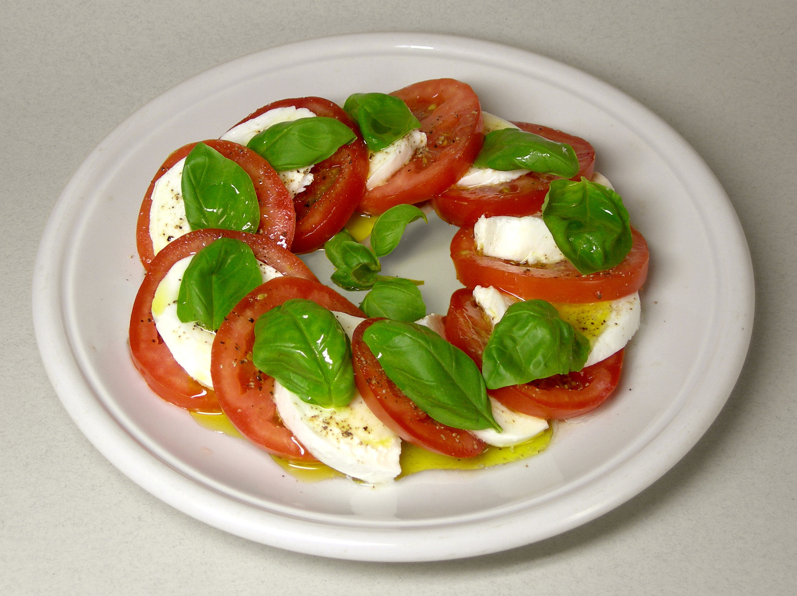

# Caprese Salad

*Slices of mozzarella, tomato and basil with olive oil, salt and a grind of pepper. Three ingredients, no negotiation, named for the island of Capri. The colours of the Italian flag (rosso, bianco, verde) on a plate. Lives or dies on tomato quality.*

**Serves:** 4

**Prep Time:** 10 minutes

**Cook Time:** 0 minutes

## Overview
Ripe summer tomatoes and good buffalo mozzarella alternate in a row, with whole basil leaves between. A heavy drizzle of extra virgin olive oil, flaky salt, freshly ground pepper. That's it. Optional balsamic if you must, but the original doesn't have any.

## Ingredients

- 4 large ripe tomatoes (a mix of colours if you can — yellow, beefsteak, plum)
- 250 g buffalo mozzarella (drained, ideally fresh-from-the-deli)
- A small bunch of fresh basil (whole leaves)
- 4 tablespoons excellent extra virgin olive oil
- Flaky sea salt
- Freshly ground black pepper

### Optional
- A drizzle of aged balsamic vinegar (purists scoff)

## Method

### Stage 1 – Slice
1. Slice the tomatoes about 1 cm thick.
1. Slice or tear the mozzarella into similar-sized pieces.

### Stage 2 – Arrange
1. On a serving platter, alternate slices of tomato and mozzarella in a row, slightly overlapping.
1. Tuck whole basil leaves between every other piece.

### Stage 3 – Dress
1. Drizzle generously with olive oil.
1. Sprinkle flaky salt over both the tomato and mozzarella.
1. Grind black pepper across.
1. Drizzle with balsamic if using.

### Stage 4 – Serve
1. Eat at room temperature; cold mozzarella has muted flavour.
1. Crusty bread alongside to mop the juices.

## Notes
- **Ripe tomatoes only:** Out-of-season pale tomatoes give a sad caprese. If yours aren't great, skip until summer.
- **Buffalo mozzarella > cow's milk:** Richer, creamier, more pronounced flavour. The cow's milk version (fior di latte) works but isn't quite the same.
- **Salt the tomatoes too:** They need their own seasoning; don't just salt the cheese.
- **No balsamic glaze, please:** The dish is meant to be about good ingredients. Sweet, syrupy balsamic glaze hides them.

## Storage
- Doesn't keep. Eat assembled.
