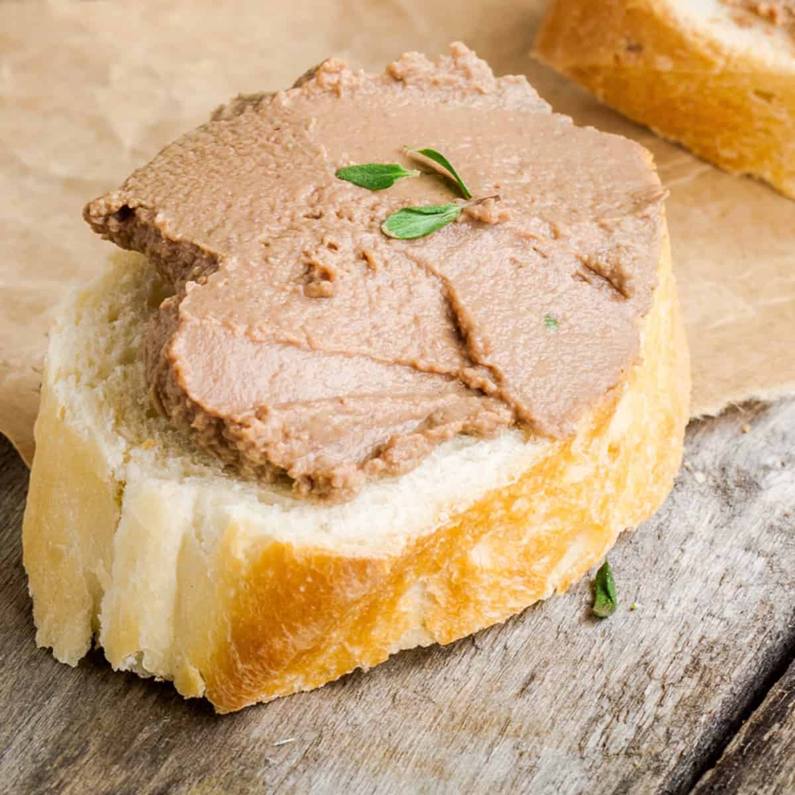

# Chicken Liver Pâté

*Smooth, butter-rich pâté: chicken livers fried fast in butter and brandy, blitzed silky with extra butter, set in a terrine. Serve cold with toasted brioche or sourdough and a sharp chutney. The classic dinner-party first course; keeps a week in the fridge.*

**Makes:** 1 small terrine (8 servings)

**Prep Time:** 15 minutes

**Cook Time:** 12 minutes

## Overview
Chicken livers fry briefly with shallot and garlic, deglaze with brandy, finish with thyme and a splash of cream. The hot mixture blends with cubed cold butter into a silky paste, presses into a terrine, and sets cold under a layer of clarified butter. Eats best after a day in the fridge.

## Ingredients

### Pâté
- 50 g unsalted butter (for the pan)
- 2 banana shallots (finely chopped)
- 4 garlic cloves (crushed)
- 500 g chicken livers (trimmed of any greenish bile or sinew)
- 50 ml brandy or cognac
- 50 ml port or Madeira (optional)
- 100 ml double cream
- 1 teaspoon fresh thyme leaves
- 200 g unsalted butter (cubed, very cold)
- Salt and freshly ground black pepper
- A grating of nutmeg

### Clarified butter top
- 75 g unsalted butter

### To serve
- Toasted brioche or sourdough
- Onion chutney or fig jam
- Cornichons

## Method

### Stage 1 – Cook the livers
1. Melt the 50 g butter in a heavy frying pan over medium heat.
1. Cook the shallots for 3-4 minutes until soft.
1. Add the garlic; cook 30 seconds.
1. Increase the heat to medium-high. Add the livers; sear for 2 minutes a side until browned outside but still pink inside (overcooked livers turn grainy in the pâté).

### Stage 2 – Deglaze
1. Pour in the brandy; let it bubble (flame off if you wish) for 30 seconds.
1. Add the port if using; reduce by half.
1. Stir in the cream and thyme; bring to a simmer; turn off the heat.

### Stage 3 – Blend
1. Tip everything into a food processor or blender.
1. With the motor running, add the cold butter cubes one at a time, blending until silky smooth.
1. Season generously with salt, pepper and nutmeg.

### Stage 4 – Pass through a sieve (optional)
1. For the smoothest texture, push the pâté through a fine sieve into a clean bowl.

### Stage 5 – Set
1. Spoon into a small terrine or 6-8 ramekins.
1. Smooth the top with a spatula.
1. Cover with cling film pressed onto the surface (no skin forms); refrigerate at least 2 hours.

### Stage 6 – Clarified butter top
1. Melt the 75 g butter in a small pan; skim foam.
1. Pour the clear yellow butter slowly over the chilled pâté, leaving milky solids behind.
1. Refrigerate until the butter sets (about 30 minutes).

### Stage 7 – Serve
1. Bring out 15 minutes before serving (cold pâté tastes muted).
1. Spread on warm toast; chutney, cornichons and a glass of cold something on the side.

## Notes
- **Don't overcook the livers:** Pink in the centre is the goal. Grey livers give grainy pâté.
- **Cold butter into hot mixture:** The temperature contrast is what gives the silky emulsion. Room-temperature butter melts into oil; you lose the structure.
- **Sieve for smoothness:** Optional but worth it for dinner parties; gives a true silk texture.

## Storage
- Keeps a week refrigerated under the butter top.
- Once cut into, eat within 3-4 days.
- Freezes 2 months wrapped tightly; defrost overnight in the fridge.
