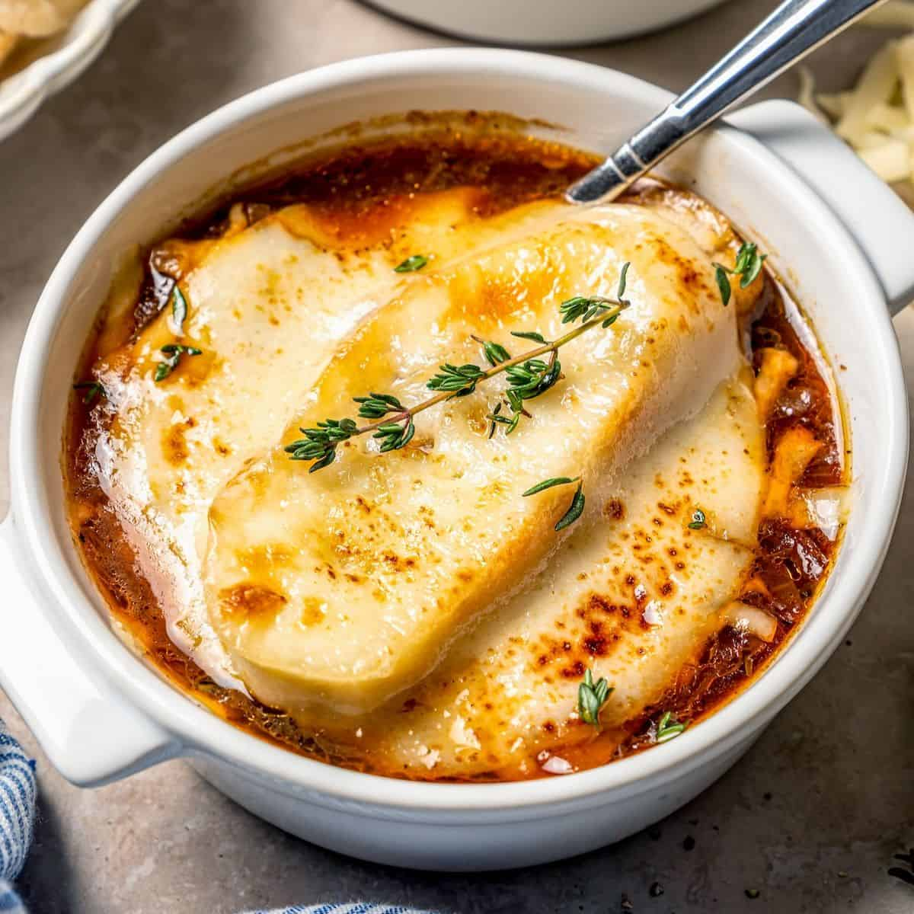

# French Onion Soup

*Soupe à l'oignon: deeply caramelised onions in a rich beef broth, topped with a thick slice of toasted baguette and a heavy lid of melted gruyère. The Parisian late-night working-class supper that's now a bistro icon. Slow onions are 80% of the dish.*

**Serves:** 4-6

**Prep Time:** 15 minutes

**Cook Time:** 1¼ hours

## Overview
Onions cook for nearly an hour in butter and oil until they're deep mahogany, almost jammy. They deglaze with sherry or cognac and meet beef stock, simmering long enough to marry. Ladled into oven-proof bowls, topped with toasted bread and gruyère, the lot grills until the cheese is bubbling.

## Ingredients

### Onion base
- 6 large onions (about 1.5 kg, very thinly sliced)
- 50 g unsalted butter
- 2 tablespoons olive oil
- 1 teaspoon caster sugar
- 1 teaspoon salt
- 4 garlic cloves (crushed)
- 1 tablespoon plain flour

### Broth
- 100 ml dry sherry, port or cognac
- 200 ml dry white wine
- 1.2 litres rich beef stock
- 2 bay leaves
- 4 thyme sprigs
- Salt and freshly ground black pepper

### To finish
- 1 baguette (cut into 8-12 thick slices)
- 200 g gruyère (grated)
- 50 g comté or extra gruyère (for the top)

## Method

### Stage 1 – Caramelise the onions
1. Melt the butter with the oil in a heavy pot over medium-low heat.
1. Add the onions, sugar and salt.
1. Cook for 45-50 minutes, stirring often, until very soft, dark and almost jammy. The longer the better; don't rush.
1. Add the garlic in the last 5 minutes.
1. Sprinkle the flour over; cook another 1-2 minutes.

### Stage 2 – Build the broth
1. Pour in the sherry; let it bubble away.
1. Add the wine; reduce by half.
1. Pour in the beef stock; add bay and thyme.
1. Simmer 25-30 minutes for flavours to meld.
1. Discard the bay and thyme. Season generously.

### Stage 3 – Toast the bread
1. Toast the baguette slices in a hot oven (200°C) for 5-6 minutes until dry and crisp.

### Stage 4 – Bake the soup
1. Heat the grill on high.
1. Ladle the soup into oven-proof bowls.
1. Place 2-3 baguette slices on top, overlapping (cover the surface).
1. Pile gruyère heavily over the bread.
1. Grill 3-4 minutes until the cheese is bubbling, deep golden, and crisping at the edges.

### Stage 5 – Serve
1. Place each bowl on a plate (they're hot).
1. Eat immediately, breaking through the cheese crust to the soup beneath.

## Notes
- **45 minutes minimum on the onions:** Pale onions give pale soup. The colour is the entire flavour foundation; rushing this step is the most common failure.
- **Mix gruyère and comté:** Gruyère melts beautifully; comté adds nuttiness. All-gruyère is fine.
- **Oven-proof bowls:** The bowls go under the grill. Standard ceramic might crack; use proper soup crocks or any thick stoneware.

## Storage
- Soup base improves overnight. Keeps 4 days refrigerated; freezes 3 months.
- Don't add the cheese-toast stage until ready to serve.
