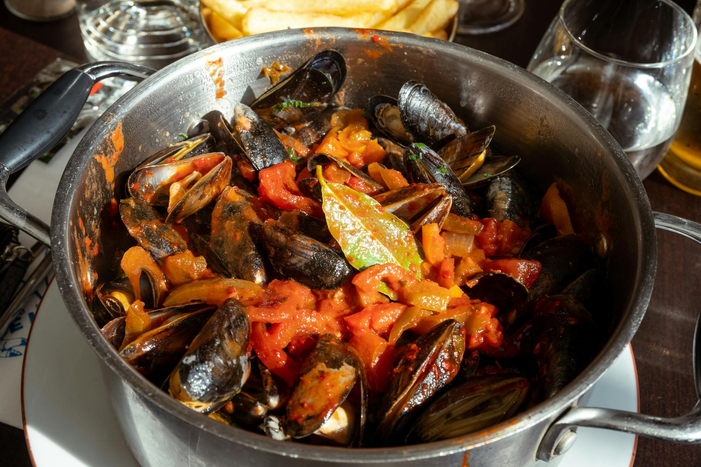

# Moules Marinière

*Belgian-French steamed mussels in white wine with shallot, garlic, parsley and butter. Twenty minutes from sea to plate; the dish that makes you wonder why you don't eat mussels every week. Crusty bread to mop the broth is half the meal.*

**Serves:** 4

**Prep Time:** 15 minutes

**Cook Time:** 12 minutes

## Overview
Cleaned mussels go into a hot pot with shallots, garlic, white wine and butter. The lid clamps on; high heat steams everything in 4-5 minutes; the mussels open. A handful of chopped parsley joins; the whole pot lands at the table. Bread on the side.

## Ingredients

- 2 kg fresh mussels
- 50 g unsalted butter (split)
- 4 banana shallots (very finely chopped)
- 6 garlic cloves (sliced)
- 300 ml dry white wine (Muscadet or Sauvignon Blanc)
- 200 ml double cream (optional, for moules à la crème)
- A small bunch of flat-leaf parsley (chopped)
- Salt and freshly ground black pepper
- 2 lemons (cut into wedges)
- Crusty bread, to serve

## Method

### Stage 1 – Clean the mussels
1. Tip the mussels into the sink and cover with cold water.
1. Scrub the shells one by one with a small brush; pull off any beards (the wiry threads).
1. Discard any mussels that don't close when sharply tapped (they're dead — not safe).
1. Drain in a colander.

### Stage 2 – Build the broth
1. Melt half the butter in a large heavy pot over medium heat.
1. Cook the shallots for 3-4 minutes until soft.
1. Add the garlic; cook 1 minute (don't brown).
1. Pour in the wine; bring to the boil.

### Stage 3 – Steam the mussels
1. Tip in the mussels; immediately clamp on the lid.
1. Cook over high heat for 4-5 minutes, shaking the pot occasionally, until all the mussels have opened.
1. Discard any that haven't opened (they were already dead).

### Stage 4 – Finish
1. Lift out most of the mussels into a warmed serving bowl with tongs.
1. Add the cream (if using) to the broth in the pot; bring back to a quick simmer.
1. Stir in the remaining butter and the parsley.
1. Pour the broth back over the mussels.

### Stage 5 – Serve
1. Bring the bowl straight to the table.
1. Lemon wedges and crusty bread alongside.
1. Eat with fingers (use an empty shell as a tweezer for the next mussel; that's traditional).

## Notes
- **Discard closed mussels before AND after cooking:** Closed before = dead. Closed after = dead. Both unsafe.
- **High heat, lid on:** Steaming is fast. Slow cooking turns mussels rubbery.
- **The broth is the prize:** Don't pour it down the sink. Bread, spoon, drink it.

## Storage
- Eat immediately. Mussels don't keep cooked; the texture dies within hours.
