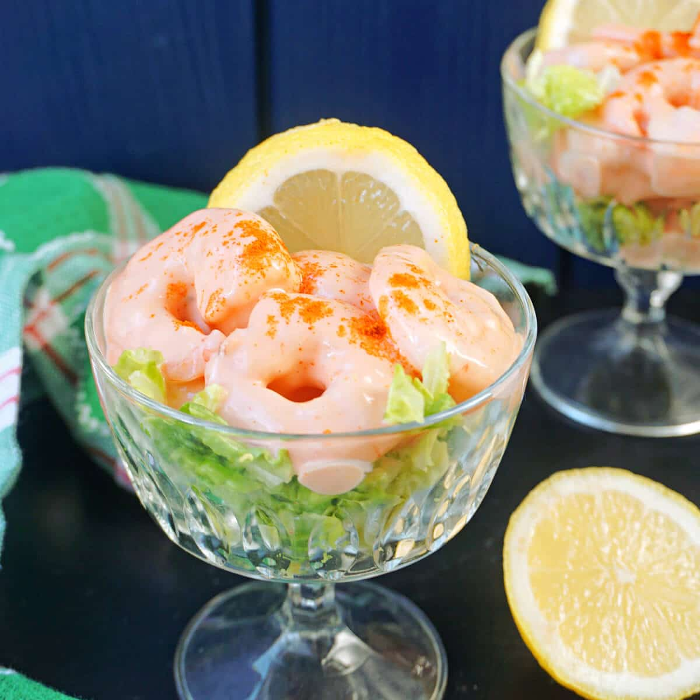

# Prawn Cocktail

*The British seventies dinner-party throwback, refusing to die because it's actually good. Cooked prawns on shredded lettuce, smothered in a mayo-ketchup-Worcestershire sauce, paprika dusted, lemon wedge. Five minutes; all the joy of nostalgia.*

**Serves:** 4

**Prep Time:** 10 minutes

**Cook Time:** 0 minutes

## Overview
Marie Rose sauce — mayo, ketchup, Worcestershire, a squeeze of lemon, a splash of brandy if you're feeling decadent — coats cooked king prawns. Piled into glasses or plates over shredded iceberg or little gem; paprika dusts the top; lemon wedge alongside.

## Ingredients

### Marie Rose sauce
- 6 tablespoons mayonnaise
- 2 tablespoons tomato ketchup
- 1 teaspoon Worcestershire sauce
- 1 teaspoon lemon juice
- A few drops Tabasco
- 1 teaspoon brandy (optional)
- A pinch of salt and white pepper

### To assemble
- 400 g cooked, peeled king prawns (deveined, tails removed)
- 1 small iceberg or 2 little gems (very finely shredded)
- 1 lemon (cut into 4 wedges)
- ½ teaspoon sweet paprika (for dusting)
- A few sprigs of dill or chives

## Method

### Stage 1 – Sauce
1. Whisk all the Marie Rose ingredients in a bowl.
1. Taste; adjust with more lemon, ketchup or Tabasco to your liking.

### Stage 2 – Prawns
1. Pat the prawns dry with kitchen paper.
1. Toss them through the sauce until evenly coated.

### Stage 3 – Assemble
1. Pile shredded lettuce in 4 glasses, martini glasses, or shallow dishes.
1. Spoon the dressed prawns on top.
1. Dust with paprika.
1. Tuck a lemon wedge on the side; scatter dill or chives.

## Notes
- **Cold ingredients:** Marie Rose loves cold prawns and crisp lettuce. Warm prawns wilt the lettuce and the sauce splits.
- **Iceberg over little gem:** Iceberg gives the proper retro crunch; little gem is fine but tastes more sophisticated than the spirit of the dish.
- **Hidden brandy:** A teaspoon adds depth without being detectable. Skip if avoiding alcohol.

## Storage
- Best assembled immediately; the sauce makes the lettuce wilt within an hour.
- Sauce keeps 3 days refrigerated; mix prawns and lettuce only when you serve.
