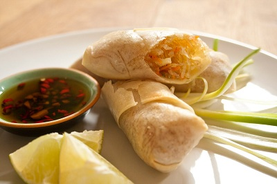

# Spring rolls with fiery chilli sauce

*This popular snack comes from South-East Asia, and would make a tasty first course. The sauce is traditionally made with hot chillies, but substitute milder ones, if you prefer.*

**Serves:** 6 - 8

## Overview
Delicate spring rolls filled with silky cellophane noodles, tender wood ears, savory pork, and sweet crab, then deep-fried until golden and crispy. Served with a vibrant, fiery chilli sauce, these Southeast Asian gems are perfect as an appetizer or main snack. The contrast between crispy exterior and tender filling is irresistible.

## Ingredients
- 25 grams cellophane noodles (soaked for 10 minutes in hot water to cover)
- 8 dried wood ears (soaked for 30 minutes in warm water to cover)
- 225 grams minced pork
- 225 grams crab meat
- 4 spring onions (finely chopped)
- teaspoon Thai fish sauce
- 250 grams spring roll wrappers
- flour and water paste (to seal spring rolls)
- vegetable oil (for frying)
- salt and freshly ground black pepper

### For the sauce
- 2 fresh red chillies (de-seeded)
- 2 garlic  cloves (chopped)
- 1 tablespoon granulated sugar
- 3 tablespoons Thai fish sauce
- juice of 1 lime (or half a lemon)

## Method

### Stage 1 – Make Sauce & Prepare Filling
1. Make the sauce by pounding the chillies and garlic to a paste.
1. Scrape into a bowl and mix in the sugar and fish sauce, with the citrus juice to taste.
1. Drain the noodles and snip them into 2.5 cm lengths.
1. Drain the wood ears, trim away any rough stems and slice the caps finely.
1. Mix with the noodles.
1. Mix the noodles and wood ears with the pork and set aside.
1. Remove any cartilage from the crab meat and add to the pork mixture, along with the spring onions and fish sauce.
1. Season to taste, mixing well.

### Stage 2 – Assemble Spring Rolls
1. Place a spring roll wrapper in front of you, diamond-fashion.
1. Spoon some mixture just below the centre, across the width.
1. Fold over the nearest point and roll once.
1. Fold in the sides to enclose the mixture, then brush the edges with flour paste and roll up to seal.
1. Repeat with the remaining spring roll wrappers and filling mixture.

### Stage 3 – Cook & Serve
1. Heat the oil in a wok or deep-fryer to 190°C.
1. Deep fry the rolls in batches for 8 - 10 minutes, and drain on kitchen paper.
1. Serve hot with the fiery chilli sauce on the side.

## Notes
- **Wood ears (Chinese black fungus):** A gelatinous species collected and cultivated in China. Adds chewy texture and umami depth.
- **Spring roll assembly:** Keep wrappers covered with a damp towel to prevent drying out. The flour paste acts as an egg wash.
- **Oil temperature:** Maintaining 190°C is essential, too cool and the rolls absorb oil; too hot and the exterior burns before the inside cooks.
- **Vietnamese serving method:** Wrap each warm spring roll in a lettuce leaf with fresh mint and coriander sprigs and dip in the sauce.

## Serving
Serve with: Fiery chilli sauce, lettuce cups, fresh herbs
Garnish with: Cilantro sprigs and lime wedges
Accompaniment: Extra sauce for generous dipping, jasmine tea

## Storage
- Best served warm immediately after frying
- Keeps 1-2 days refrigerated in an airtight container
- Reheat in a 160°C oven for 5-8 minutes until recrisped
- Freezes well up to 3 months (freeze before or after cooking)
- Sauce keeps 1 week refrigerated in a sealed jar