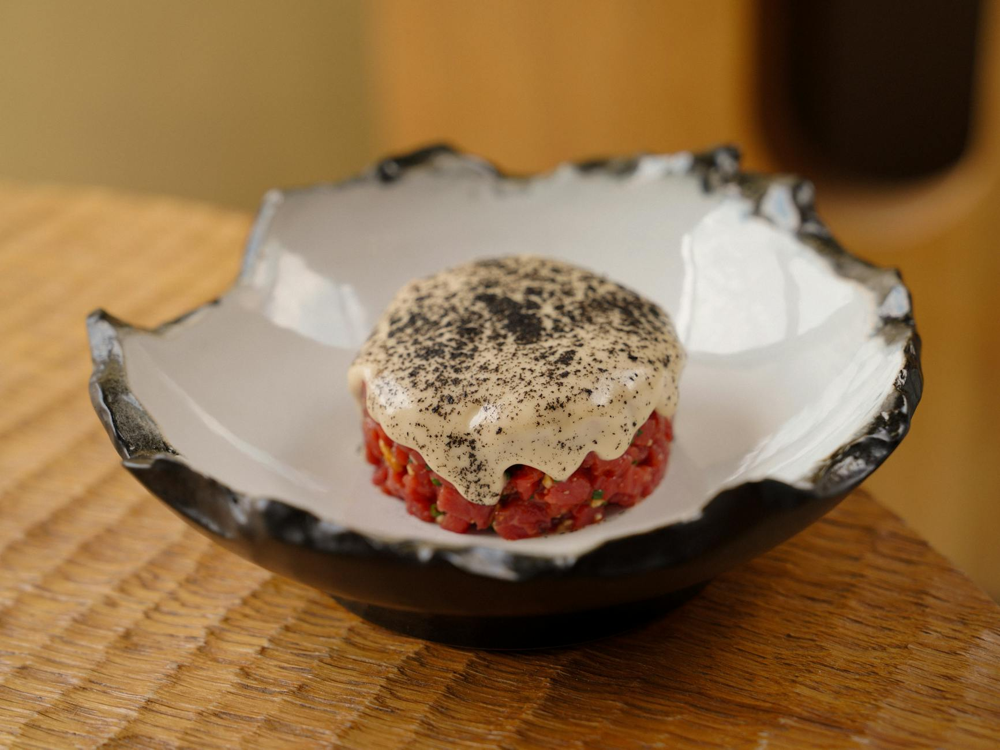

# Steak Tartare

*Raw beef fillet hand-chopped fine, mixed with capers, gherkins, shallot, parsley, mustard and Worcestershire, topped with a raw egg yolk, served with toast and a green salad. The most adult dinner-party starter; not for the squeamish but the most luxurious thing you can eat at room temperature.*

**Serves:** 4

**Prep Time:** 20 minutes

**Cook Time:** 0 minutes

## Overview
Centre-cut beef fillet is hand-chopped (don't blitz; the texture matters) and mixed with the seasonings just before serving. Plated in a neat ring, topped with a yolk in a half-shell or directly on top, served with hot toast and a small dressed salad.

## Ingredients

### Tartare
- 500 g beef fillet (centre-cut, very fresh; tell the butcher it's for tartare)
- 2 banana shallots (very finely chopped)
- 2 tablespoons capers in brine (rinsed, finely chopped)
- 4 cornichons (finely chopped)
- 1 tablespoon Dijon mustard
- 2 teaspoons Worcestershire sauce
- A few drops Tabasco
- 1 tablespoon ketchup (optional, for tartare classique)
- 2 tablespoons flat-leaf parsley (finely chopped)
- 4 anchovy fillets (mashed; optional)
- 4 large egg yolks (in their half-shells or at the centre of the plate)
- 4 tablespoons extra virgin olive oil
- Salt and freshly ground black pepper

### To serve
- Toasted sourdough or brioche
- A small dressed salad (lemon-dressed lamb's lettuce or rocket)

## Method

### Stage 1 – Prep the beef
1. With a very sharp knife, slice the beef into 5 mm strips, then into 5 mm cubes, then chop finely (don't pulverise; aim for a coarse mince texture).
1. Refrigerate while you prep the rest.

### Stage 2 – Mix
1. In a chilled bowl, combine the chopped beef with the shallot, capers, cornichons, mustard, Worcestershire, Tabasco, ketchup if using, parsley and anchovies (if using).
1. Drizzle in the olive oil; season with salt and pepper.
1. Mix gently with a fork; don't overwork or the texture compacts.
1. Taste; adjust mustard, Worcestershire or Tabasco to your liking.

### Stage 3 – Plate
1. Use a metal ring (or a clean tin can with both ends removed) to form a neat puck on each plate.
1. Make a shallow well in the centre.
1. Slide an egg yolk into each well (or rest it in a half-shell propped on top).

### Stage 4 – Serve
1. Set toast and a small salad on the side.
1. Diners mix the yolk through the beef before eating.

## Notes
- **Freshness is essential:** Tell the butcher you're making tartare. Use the same day. If you're nervous, freeze the fillet for 24 hours at -20°C first (kills any parasites; texture barely changes).
- **Hand-chop, don't blitz:** A food processor turns it into mince paste. The texture should be fine but distinguishable.
- **Egg yolk freshness:** Use the freshest pasteurised eggs you can. The yolk must be unbroken until the diner mixes it through.

## Storage
- Doesn't keep. Eat within an hour of mixing; raw beef oxidises and loses its bright colour.
