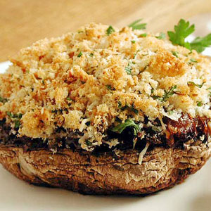

# Stuffed portobello mushrooms

*This wonderfully aromatic stuffed mushroom is particularly good as a starter or a side dish.*

**Serves:** 2

## Overview
Large, meaty portobello mushroom caps baked with a savory-aromatic filling of Brie-style blue cheese, crispy breadcrumbs, garlic, and fresh parsley. The result is a beautiful, vegetarian-friendly starter or side dish with rich, umami flavors and a satisfying texture contrast between soft cheese and crispy topping.

## Ingredients
- 4 portobello mushrooms
- 150 grams Brie-style blue cheese (diced)
- 50 grams fresh bread crumbs
- small bunch of parsley (finely chopped)
- 5 cloves garlic (peeled and finely chopped)
- olive oil (for drizzling)

## Method
1. Preheat the oven to 180°C.
1. Put the mushrooms on a foil-lined baking sheet and sprinkle over the diced cheese.
1. Mix together the breadcrumbs, parsley and garlic. 
1. Season with salt and pepper. 
1. Spoon on to the mushrooms and cheese, drizzle over a little olive oil and bake for 20 minutes, until the mushrooms are soft and the cheese has melted.

## Notes
- **Mushroom selection:** Choose large portobello mushrooms (8-10 cm diameter) with firm flesh that won't collapse during baking.
- **Cheese options:** Brie-style blue cheese adds richness; you can substitute with gruyère, emmental, or a combination for variation.
- **Make-ahead:** Assemble the mushrooms on the baking sheet up to 12 hours ahead, cover, and refrigerate. Add 2-3 minutes to baking time if cooking from cold.
- **Serving temperature:** Allow to cool for 1-2 minutes before serving as the cheese will be very hot.

## Serving
Serve with: Crusty bread to soak up the cheese filling
Garnish with: Fresh parsley leaves and a twist of black pepper
Accompaniment: Mixed green salad tossed with vinaigrette

## Storage
- Keeps 1-2 days refrigerated in an airtight container
- Unsuitable for freezing due to mushroom texture degradation
- Reheat gently at 160°C for 5-10 minutes until warmed through
- Best served fresh and warm from the oven