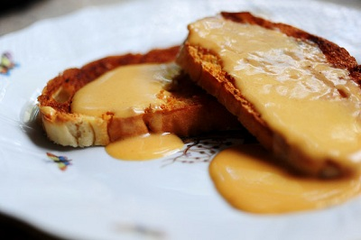

# Welsh rarebit

*This succulent, mouth watering rarebit is perfect spread on lightly buttered toast and then cooked under a hot grill for a few minutes, until browned and bubbling. It is also delightful spread over smoked haddock, and coloured under a grill, the haddock will then need to be finished in a pre-heated oven (180°C) for 3 - 4 minutes.*

**Serves:** 16

## Overview
A classic British cheese sauce, creamy, tangy, and rich with mature Cheddar, that's baked until bubbling. While traditionally spooned over toast, this versatile preparation also works beautifully over smoked haddock or vegetables. The silky sauce coating crispy bread is pure comfort food elevated to bistro standards.

## Ingredients
- 700 grams mature Cheddar (grated)
- 150 ml milk
- 25 grams plain flour
- 50 grams fresh white breadcrumbs
- 1 tablespoon English mustard powder
- half teaspoon Worcestershire sauce
- salt and freshly ground white pepper
- 2 eggs
- 2 egg yolks

## Method

### Stage 1 – Make Sauce Base
1. Put the Cheddar into a pan and add the milk.
1. Slowly melt them together over a low heat, but do not allow the mixture to boil as this will separate the cheese.
1. When the mixture is smooth and just begins to bubble, add the flour, breadcrumbs and mustard and cook for a few minutes, stirring over a low heat, until the mixture comes away from the sides of the pan and begins to form a small ball shape.
1. Add the Worcestershire sauce, salt and pepper and leave to cool.

### Stage 2 – Finish & Chill
1. When cold, transfer to a food processor and add the eggs and egg yolks, and process until combined.
1. When the eggs are mixed in, chill for a few hours before using.
1. After it has rested in the fridge, you will find the rarebit is very easy to handle.

## Notes
- **Cheese selection:** Mature Cheddar is essential, avoid mild varieties which lack the sharpness this dish needs.
- **Temperature control:** Keep heat low when melting cheese to prevent separation and grittiness.
- **Make-ahead friendly:** The chilled rarebit keeps for up to 3 days refrigerated, making this an excellent dish for entertaining.
- **Application tips:** Spread generously over buttered toast or scored fish, then grill until golden and bubbling.

## Serving
Serve with: Buttered toast, smoked haddock, or steamed vegetables
Garnish with: Paprika, fresh parsley, or minced fresh chives
Accompaniment: Crisp salad and crusty bread

## Storage
- Keeps 3-4 days refrigerated in an airtight container
- Freezes well up to 2 months before spreading and grilling
- Best used by spreading and grilling fresh; do not reheat once cooked
- Once spread on bread and baked, serve immediately for best texture