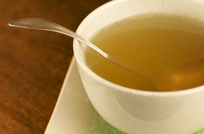

# Chinese Chicken Stock

*This Chinese chicken stock is an all-purpose base, not only for soups but also for sauces and glazes. It is light and delicious, and easy to make, providing rich, clean broth with delicate chicken essence and subtle Oriental aromatics.*

**Prep Time:** 20 minutes
**Cook Time:** 2-4 hours
**Yield:** Approximately 3 litres

## Overview

Chinese chicken stock is fundamentally different from classical French white stock in both technique and philosophy. The essential distinction is the "never boil" principle, the stock must never reach a full rolling boil, as boiling incorporates impurities and creates permanent cloudiness. The correct technique begins with uncooked (not blanched) chicken bones and meat, which are essential for richness and flavor; is never boiled; requires long, gentle simmering (2-4 hours) post-aromatic addition; and relies on careful skimming throughout cooking without any vigorous disturbance to the liquid surface.

## Ingredients

### Protein Base
- 2 kilograms uncooked chicken bones
- 700 grams chicken pieces (preferably wings or thighs, meat is essential for richness)

### Liquid Base
- 3 litres cold water

### Aromatics
- 2 slices fresh ginger (approximately 1-2 centimeters thick, skin intact, lightly crushed)
- 2 spring onions (white parts only, rinsed, cut into 5-centimeter pieces)
- 2 garlic cloves (unpeeled, lightly crushed)
- ½ teaspoon sea salt

## Method

### Stage 1 – Prepare Chicken
1. Place 2 kilograms uncooked chicken bones and 700 grams chicken pieces into a very large pot.
1. The bones should be uncooked (not blanched).
1. Pat the chicken dry with paper towels.

### Stage 2 – Initial Water Cover
1. Pour enough cold water into the pot to barely cover the chicken pieces and bones (approximately 3 litres total).
1. Place the pot over a medium heat.

### Stage 3 – Slow Heating & First Skimming
1. Slowly bring to a gentle simmer over medium heat (approximately 10-15 minutes).
1. Watch carefully, the water should never reach a full rolling boil.
1. Using a large,  flat spoon, skim the surface regularly to remove scum and impurities.
1. Do not stir the stock.

### Stage 4 – Prepare Aromatics
1. While the initial skimming occurs, cut ginger into diagonal slices, leaving skin intact.
1. Lightly crush the slices to release ginger oils.
1. Cut spring onions into 5-centimeter pieces.
1. Lightly crush garlic cloves (leaving skins on).

### Stage 5 – Add Aromatics
1. After approximately 5 minutes of initial heating and skimming, add the ginger, spring onions, and garlic.
1. Add ½ teaspoon sea salt.
1. Reduce the heat to very low; if possible, use a diffuser.

### Stage 6 – Long Gentle Simmer
1. Reduce the heat to very low, surface should show only the slowest, gentlest bubbling.
1. Check the heat every 10 minutes to ensure the stock is not boiling.
1. Simmer gently for between 2 and 4 hours.
1. Skim the surface occasionally (every 30-45 minutes) but gently.

### Stage 7 – Strain Through Muslin
1. After desired cooking time, carefully ladle the stock through a fine-meshed sieve lined with damp muslin.
1. Ladle gently to avoid forcing sediment.
1. Allow the liquid to flow naturally by gravity.
1. Discard all solids and muslin.

### Stage 8 – Cool & Store
1. Allow strained stock to cool to room temperature.
1. Once cooled, skim off any surface fat.
1. Use immediately or decant into storage containers.

## Notes
- **Never Boil Rule Critical:** Boiling creates permanent cloudiness. Maintain bare simmer throughout.
- **Uncooked Bones Essential:** Uncooked bones and meat are essential for richness and flavor development.
- **Meat Inclusion Essential:** Meat is required for richness. Bones alone create weak stock.
- **Ginger-Garlic Aromatics:** Signature Chinese aromatics. Do not substitute.
- **Gentle Skimming Only:** Do not stir. Use gentle surface skimming only.
- **Heat Management Crucial:** Use a diffuser if possible. Regular checking prevents boiling.
- **Cooking Duration Flexible:** 2-4 hour range allows for preference. Shorter = lighter; longer = richer.
- **Muslin-Lined Straining Essential:** Final straining ensures crystal clarity.
- **Stock Clarity:** Clear, translucent stock indicates proper technique.

## Variations
- **With Star Anise:** Add 1-2 star anise for subtle aromatic spice.
- **Extra Ginger:** Use 3-4 slices for more pronounced ginger character.
- **With Shiitake:** Add 1-2 dried shiitake mushrooms for umami depth.
- **Shorter Simmer:** Reduce to 2 hours for lighter stock.
- **Longer Simmer:** Extend to 4 hours for richer stock.

## Serving
- **Primary Use:** Base for Chinese soups, clear broths
- **Secondary Use:** Sauce base, glaze liquid
- **Temperature:** Heat to steaming (90°C)
- **Pairing:** Noodle preparations, dumpling accompaniments

## Storage
- **Refrigeration:** 4-5 days in covered container
- **Freezing:** Up to 3 months
- **Reheating:** Thaw in refrigerator, then reheat very gently
- **Smell Test:** Always verify pleasant aroma before use