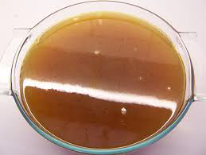

# Lamb Stock

*Light yet distinctly flavorful, lamb stock provides the essential foundation for sophisticated lamb preparations, enriching pan sauces, gravies, and elegant meat-based dishes with subtle ovine character.*

**Prep Time:** 20 minutes
**Cook Time:** 2 hours
**Yield:** Approximately 1 litre

## Overview

Lamb stock (fond d'agneau) occupies a distinct position between delicate white stocks and robust brown stocks. Unlike white stocks made from blanched bones, lamb stock begins with browned meat pieces, creating stock with visible flavor and color without the heaviness of veal or beef stock. The brown roasting technique develops complex, savory flavors characteristic of lamb, while remaining lighter and clearer than full-brown stocks due to shorter overall cooking time. The inclusion of tarragon (an affinity with lamb) provides herbal character, while tomatoes add acidity and subtle sweetness. White wine reduction concentrates the acidity and prevents overly acidic finished stock. Success depends on proper browning (pale golden, not dark), precise skimming (especially after the first 10 minutes), and maintaining a gentle simmer throughout. The finished stock should be clear, amber in color, with distinctly pleasant lamb aroma.

## Ingredients

### Meat Base
- Approximately 800 grams lamb bones or lamb scraps/trimmings

### Aromatics & Vegetables
- 150 grams carrots (cut into rounds, approximately 1 centimeter)
- 100 grams onions (coarsely chopped)
- 1 stalk celery (approximately 10 centimeters, chopped)

### Liquid Base
- 250 millilitres dry white wine
- 2.5 litres cold water

### Seasonings & Aromatics
- 4 medium tomatoes (peeled, de-seeded, and coarsely chopped, or 100 grams canned tomatoes)
- 2 cloves garlic (unpeeled)
- 1 Bouquet garni
- 2 sprigs fresh tarragon (essential, do not substitute)
- 6 white peppercorns (crushed and tied in muslin)

## Method

### Stage 1 – Prepare Lamb
1. Preheat oven to 220°C (425°F).
1. Cut approximately 800 grams lamb into pieces of approximately 5-7 centimeters.
1. Pat dry with paper towels (moisture prevents proper browning).
1. Place in a roasting pan in a single layer, not crowded.

### Stage 2 – Roast & Brown Lamb
1. Place the roasting pan in the preheated 220°C oven.
1. Roast for approximately 20 minutes, turning the pieces over with a slotted spoon every 5 minutes.
1. Lamb should develop a pale golden to light brown exterior (not dark brown).
1. Aroma should be pleasant and increasingly savory.

### Stage 3 – Add Vegetables & Continue Roasting
1. Add 150 grams carrots (cut into rounds) and 100 grams onions (coarsely chopped).
1. Toss together and return to the oven.
1. Continue roasting for exactly 5 minutes.
1. Vegetables should begin to caramelize without burning.

### Stage 4 – Deglaze & Transfer
1. Using a slotted spoon, transfer all lamb and roasted vegetables to a large saucepan.
1. Pour off excess fat from the roasting pan.
1. Pour 250 millilitres dry white wine into the hot pan, scraping vigorously with a wooden spoon.
1. Place over high heat and reduce the wine by half (approximately 2-3 minutes).
1. Pour this wine reduction into the saucepan with the lamb and vegetables.

### Stage 5 – Add Water & Initial Cooking
1. Add 2.5 litres cold water to the saucepan.
1. Place over high heat and bring to a rolling boil (approximately 15-20 minutes).
1. As soon as the liquid reaches a full boil, immediately lower the heat to very low.
1. The surface should be barely trembling.
1. Allow to simmer for exactly 10 minutes.

### Stage 6 – Initial Skimming (Critical)
1. During these first 10 minutes, use a large, flat spoon to remove all impurities and scum.
1. Skim repeatedly and thoroughly (8-10 passes).
1. This initial skimming is essential.
1. Do not stir the stock.

### Stage 7 – Add Aromatics
1. After the first 10 minutes, add all remaining ingredients: celery, tomatoes, garlic, bouquet garni, and 2 sprigs fresh tarragon.
1. Stir gently to distribute ingredients.
1. Reduce heat to maintain bare simmer.
1. Do not stir again.

### Stage 8 – Long Simmer with Occasional Skimming
1. Simmer gently, uncovered, for 1.5 hours (90 minutes).
1. Skim the surface occasionally (every 20-30 minutes).
1. Do not cover the pot.

### Stage 9 – Add Peppercorns
1. Approximately 10 minutes before the end (at the 80-minute mark), add the muslin-wrapped 6 white peppercorns.
1. Stir gently to distribute.

### Stage 10 – Strain
1. Place a fine-meshed sieve over a clean bowl.
1. Carefully ladle the stock through the strainer.
1. Allow gentle flow without forcing.
1. Discard all solids.

### Stage 11 – Cool Over Ice
1. Allow strained stock to cool slightly to room temperature (approximately 10-15 minutes).
1. Prepare a large bowl of ice water.
1. Place the bowl with warm stock into the ice bath.
1. Cool completely (approximately 30 minutes).

### Stage 12 – Remove Fat & Final Storage
1. Once cooled, a layer of fat will have solidified on the surface.
1. Skim off and discard this fat.
1. The stock should be clear, amber in color.
1. Decant into storage containers.

## Notes
- **Tarragon Essential:** Fresh tarragon is traditional and essential for lamb stock; do not substitute.
- **Roasting Color Critical:** Pale golden creates delicate stock; dark brown creates bitter stock.
- **Initial Skimming Essential:** First 10 minutes produces most impurities. Thorough skimming determines clarity.
- **Wine Reduction Technique:** Half-reduction concentrates acidity and prevents overly acidic stock.
- **Simmering Duration:** 1.5 hours produces balanced lamb character.

## Variations
- **With Additional Tarragon:** Use 3-4 sprigs for more pronounced herbal character.
- **With Thyme:** Add 1-2 additional sprigs fresh thyme for earthy character.
- **Lighter Version:** Reduce cooking time to 1 hour.
- **With Red Wine:** Use red wine instead of white for deeper, earthier character.

## Serving
- **Primary Use:** Base for lamb sauces, pan gravies
- **Secondary Use:** Enrichment for vegetable soups
- **Temperature:** Reheat to steaming (90°C); do not boil
- **Pairing:** Lamb preparations, rustic meat dishes, herb-based preparations

## Storage
- **Refrigeration:** 3-4 days in covered container
- **Freezing:** Up to 3 months
- **Fat Layer:** Thin layer is protective
- **Gelatin Behavior:** Stock will gel slightly when cold if bones were included
- **Reheating:** Thaw in refrigerator, then reheat gently