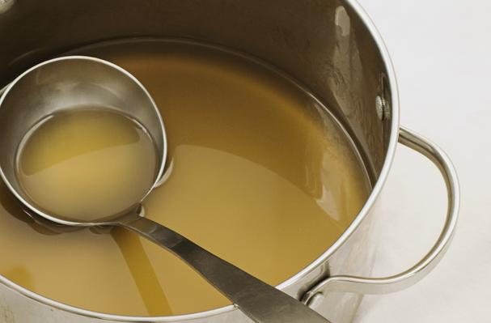

# White Veal Stock

*The foundation of French cuisine, white veal stock is a delicate and gelatinous preparation that forms the base for most mother sauces and refined meat preparations.*

**Prep Time:** 30 minutes
**Cook Time:** 2.5 hours
**Yield:** Approximately 1 litre

## Overview

White veal stock (fond blanc de veau) is the cornerstone of classical French sauce-making. Unlike brown veal stock, white stock is created by roasting bones until pale golden (not dark brown) and maintaining a clear, delicate appearance throughout cooking. The inclusion of calf's foot (or calf's knuckle) is essential, providing natural gelatin that gives the finished stock its signature silky mouthfeel and body. Success depends on maintaining a bare simmer (surface barely trembling, not rolling), thorough initial skimming to remove impurities (which cloud the stock), and roasting bones to the correct color (pale golden, not dark). The finished stock should be crystal clear, pale ivory in color, and richly flavored with subtle veal umami. This stock forms the base for velouté sauces, supreme sauces, and provides depth to braises and braised vegetables.

## Ingredients

### Bones & Gelatin
- 1.5 kilograms veal bones (chopped into 5-7 centimeter pieces)
- ½ calf's foot (split lengthwise, blanched for 5 minutes, then chopped)

### Aromatics & Vegetables
- 200 grams carrots (cut into rounds, approximately 1 centimeter thick)
- 100 grams onion (coarsely chopped, no need to peel)
- 1 stalk celery (approximately 10 centimeters, thinly sliced)
- 2 cloves garlic (unpeeled)

### Liquid & Seasoning
- 250 millilitres dry white wine (unoaked, neutral acidity preferred)
- 3 litres cold water
- 6 tomatoes (peeled, de-seeded, and coarsely chopped, or 150 grams canned tomatoes in juice)
- 150 grams button mushrooms (thinly sliced)
- 1 Bouquet garni (thyme, bay leaf, parsley stems)
- 1 sprig fresh tarragon (inside the bouquet garni)

## Method

### Stage 1 – Prepare & Roast Bones
1. Preheat oven to 200°C (400°F).
1. Place 1.5 kilograms veal bones (chopped) into a roasting pan in a single layer, not crowded.
1. Place into the preheated oven and roast for approximately 40 minutes, turning the bones every 10 minutes with a slotted spoon.
1. Bones should become pale golden in color (not dark brown, dark indicates over-roasting, which creates dark stock).
1. The interior of the bones will smell fragrant and meaty when ready.

### Stage 2 – Add Vegetables & Continue Roasting
1. Add 200 grams carrots (cut into rounds) and 100 grams onion (coarsely chopped) to the roasting pan.
1. Toss together and return to the oven.
1. Continue roasting for exactly 5 minutes, stirring occasionally.
1. The vegetables should begin to caramelize at their edges.
1. Do not allow vegetables to burn.

### Stage 3 – Deglaze & Transfer
1. Remove the roasting pan from the oven.
1. Using a slotted spoon, carefully transfer all bones and vegetables to a large saucepan or stock pot.
1. Pour off any collected fat from the roasting pan (discard this fat).
1. Pour 250 millilitres dry white wine into the hot roasting pan, scraping vigorously with a wooden spoon to dissolve all the sediment and caramelized bits stuck to the bottom.
1. Place the roasting pan over high heat and reduce the wine by half (approximately 2-3 minutes), scraping constantly.
1. Pour this wine reduction into the saucepan with the bones.

### Stage 4 – Initial Water & Skimming
1. Add 3 litres cold water to the saucepan.
1. Place over high heat and bring to a rolling boil (this will take 15-20 minutes).
1. As soon as the liquid reaches a full boil, immediately reduce the heat to very low.
1. The surface should be barely trembling, individual bubbles should rise slowly, not a rolling simmer.
1. Allow to simmer gently for exactly 10 minutes.
1. Using a large, flat spoon or skimmer, remove all impurities and scum that have risen to the surface.
1. Skim thoroughly and repeatedly until the surface is clean and clear.
1. This is essential: impurities create cloudiness in the final stock.

### Stage 5 – Add Aromatics & Long Simmer
1. Add all remaining ingredients: celery, garlic, tomatoes, mushrooms, bouquet garni with tarragon.
1. Reduce heat to bare simmer (surface barely trembling, use a diffuser under the pot if available).
1. Simmer, uncovered, for 2.5 hours.
1. During cooking, skim the surface as necessary (especially after the first 30 minutes).
1. Do not stir the stock; any disturbance clouds it.
1. The liquid should reduce by approximately 1/3 by the end of cooking.

### Stage 6 – Strain & Cool
1. Place a fine-meshed conical sieve over a clean bowl.
1. Carefully ladle the stock through the strainer, allowing the liquid to flow gently.
1. Discard the solids.
1. Allow the strained stock to cool to room temperature (approximately 1-2 hours).
1. Prepare a bowl of ice water.
1. Place the bowl of warm stock into the ice bath to cool completely (approximately 30 minutes).

## Notes
- **Bone Selection Critical:** Veal bones provide delicate flavor and high gelatin content.
- **Calf's Foot Essential:** This provides natural gelatin for silky body. Do not omit.
- **Never Boil:** Boiling causes permanent cloudiness. Maintain bare simmer throughout.
- **Initial Skimming Essential:** First 10 minutes and determines clarity.
- **Stock Clarity Test:** Pale ivory and translucent indicates success.

## Variations
- **With Peppercorns:** Add 6-8 white peppercorns for subtle spice.
- **Lighter Style:** Reduce cooking time to 2 hours.
- **Herb-Forward:** Add 2 additional sprigs fresh thyme.
- **With Shallots:** Substitute some onion with shallots for delicate character.
- **Madeira Addition:** Deglaze with Madeira instead of white wine.

## Serving
- **Primary Use:** Base for classical mother sauces and refined preparations
- **Temperature:** Reheat to steaming (90°C); do not boil
- **Pairing:** Light meats, refined vegetables

## Storage
- **Refrigeration:** 3-4 days in covered container
- **Freezing:** Up to 3 months
- **Gelatin Behavior:** Stock will gel when cold (correct); will liquify when reheated
- **Fat Layer:** Thin layer is protective; skim before use if a cleaner stock is required