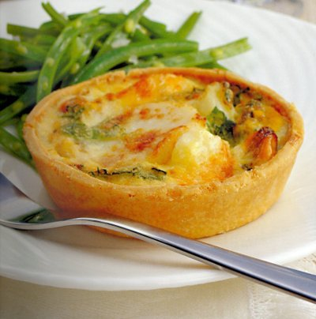

# Lightly Curried Seafood Flan

*Tender seaweed is a tasty, attractive addition to these light, creamy seafood flans, but it is not always easy to obtain.*

**Serves:** 6

**Prep Time:** 25 minutes

**Cook Time:** 55 minutes

## Overview
Elegant individual flans featuring fresh shellfish, mussels, scallops, and langoustines, in a silky curry-infused custard set within a crisp pastry case. The delicate interplay of seafood sweetness and warm curry spice creates a sophisticated starter worthy of special occasions. Best served warm from the oven.

## Ingredients
### Pastry base
- 375 g [shortcrust pastry](../../baking/pastry/shortcrust-pastry.md)

### Seafood
- 24 fresh mussels (cleaned)
- 3 large scallops
- 6 langoustines (cleaned)
- 100 g tender green seaweed (optional)

### Flavouring
- 75 ml dry white wine
- 1 shallot (finely chopped)
- 1 tbsp curry powder

### Custard
- 75 ml double cream
- 1 whole egg
- Salt and freshly ground pepper

## Method
### Make the filling
1. Put the mussels, wine and shallot in a large saucepan, cover tightly and cook briskly for 2 - 3 minutes until the mussels have opened; discard any that stay closed.
1. Take the mussels out of their shells and place in a bowl, cover with cling film and set aside.
1. Pour the cooking juices into a small pan, heat to below simmering (no more than 80°C) and gently poach the scallops for 3 minutes.
1. Remove them with a slotted spoon and add to the mussels, leaving the juices in the pan.
1. Lightly cook the langoustines in simmering water for 2 minutes, then drain.
1. Pull off the heads from the langoustines, chop these and add them to the pan containing the reserved cooking juices.
1. Sprinkle in the curry powder.
1. Simmer for 3 - 4 minutes, then strain through a chinois or fine-meshed conical sieve, pressing with the back of a spoon to extract as much juice as possible.
1. Keep the langoustine tails to one side.

### Prepare the pastry
1. Roll out the pastry to a 3 mm thickness.
1. Using a 15 cm cutter or plate as a guide, cut out 6 rounds.
1. Use these to line 6 individual flan tins, 10 cm in diameter and 2 cm deep.
1. Chill the pastry in the fridge for 20 minutes.

### Blind bake the pastry
1. Preheat the oven to 180°C.
1. Prick the pastry case bases.
1. Line the pastry cases with greaseproof paper, and fill with a layer of baking beans.
1. Bake the cases blind in the oven for 10 minutes.
1. Lower the oven temperature to 170°C.
1. Remove the paper and the beans and return the pastry cases to the oven for 5 minutes.
1. Leave the pastry cases in the tins to cool.

### Cook the flan
1. Halve the scallops horizontally and place one scallop disc in each flan case.
1. Shell the langoustine tails, halve them length ways and place 2 halves around the scallop in each flan case.
1. Fill the gaps with the mussels.
1. If using seaweed, arrange it on top.
1. In a bowl, mix the cream, egg, egg yolk and reserved curry-flavoured juices.
1. Season with salt and pepper to taste.
1. Pour the mixture over the seafood in the flan cases and bake for about 20 minutes until the filling has set.
1. To check, delicately insert a knife tip into the centre, if it comes out clean the flans are ready.

## Notes
- **Seaweed optional:** Adds visual appeal and subtle briny note; unavailable seaweed can be omitted without compromising the dish.
- **Shellfish quality:** Use the freshest shellfish available; discard any mussels that don't open after cooking.
- **Custard setting:** The flan is done when a knife inserted in centre comes out clean; overbaking causes toughness.
- **Curry powder:** Fresh curry powder provides best flavour; stale powder will taste flat and bitter.

## Serving
Serve warm straight from the oven, accompanied by a simple frisée salad with garlic croûtons and a crisp white wine.

## Storage
- Best eaten warm immediately after baking; do not refrigerate.
- Leftover flans can be stored refrigerated for 1 day and gently reheated in a warm oven.
- Do not freeze; seafood-based custards do not refreeze well.
