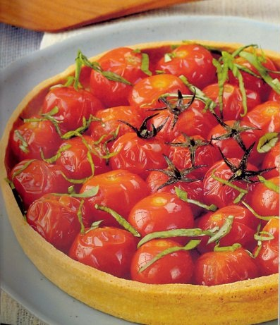

# Semi-Confit Cherry Tomato Tart

*The cherry tomatoes need to be lightly confit, in order to preserve their fresh fruity taste. To fully appreciate the flavour, serve at room temperature, never straight from the fridge.*

**Serves:** 6

**Prep Time:** 15 minutes

**Cook Time:** 75 minutes

## Overview
A rustic yet sophisticated tart featuring slowly roasted cherry tomatoes with fragrant basil and garlic on a crisp pastry base. The semi-confit technique concentrates tomato sweetness while preserving brightness. A summer-perfect vegetarian tart celebrating tomatoes at their peak.

## Ingredients
### Pastry
- 260 g [shortcrust pastry](../../baking/pastry/shortcrust-pastry.md)

### Base
- 4 tbsp white rice
- 3 tbsp strong Dijon mustard
- 2 tbsp double cream (lightly whipped)
- Salt and freshly ground pepper

### Topping
- 500 g semi-confit cherry tomatoes
- 6 basil leaves (snipped)

## Method
### To make the tart case
1. Roll out the pastry to a round, 3 mm thick, and use to line a 20 cm diameter (3.5 cm deep) flan ring and chill in the refrigerator for at least 20 minutes.
1. Preheat the oven to 190°C.
1. Prick the pastry bases with a fork.
1. Line the pastry case with greaseproof paper, and fill with a layer of baking beans.
1. Bake the case blind in the oven for 40 minutes until it is completely cooked.
1. Lower the oven temperature to 170°C.
1. Remove the paper and the beans and return the pastry case to the oven for 15 minutes.
1. Set the pastry aside to cool.
1. Lift off the flan ring and transfer the pastry case to a wire rack and leave to cool.

### To make the filling
1. In the meantime, cook the rice in boiling salted water for 18 minutes.
1. Refresh the rice under cold running water and drain thoroughly.
1. Tip the cooked rice into a bowl and mix with the mustard then the whipped cream.
1. Season and spread the rice mixture in the pastry case.
1. Arrange the cherry tomatoes on the rice, placing those still with stalks in the centre.
1. Scatter over the snipped basil and serve at room temperature.

## Notes
- **Semi-confit tomatoes:** Slowly cooked at low temperature preserves bright flavour while concentrating sweetness; this differs from fully confit preparations.
- **Rice layer:** Absorbs moisture from tomatoes, preventing a soggy pastry base.
- **Dijon mustard:** Strong version provides foundation flavour; balance carefully against tomato sweetness.
- **Room temperature serving:** Essential for full flavour; cold temperatures mute tomato taste and basil aromatics.

## Serving
Serve at room temperature as a vegetarian main course or elegant side dish. Pairs beautifully with fresh chèvre or mozzarella and a crisp sauvignon blanc.

## Storage
- Best eaten the day of serving; do not refrigerate as cold temperatures diminish flavour significantly.
- Leftovers keep 1 day at room temperature, covered.
- Do not freeze; the texture and fresh flavour will be compromised.