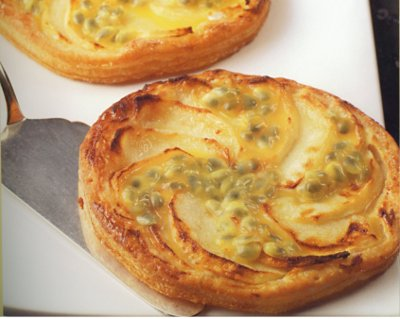

# Apple and passion fruit tartlets

*The passion fruit in these tartlets enhances the flavour of the apple in a most unexpected way.*

*To enjoy these tartlets at their best, serve them warm, about 10 minutes after they come out of the oven.*

**Serves:** 6
**Prep Time:** 25 minutes
**Cook Time:** 20 minutes

## Overview
These tartlets combine flaky puff pastry with a creamy crème pâtissière and delicate apple slices, finished with fresh passion fruit pulp. They are best served warm so the fruit and custard remain tender and fragrant.

## Ingredients
### Pastry
- 380 grams [classic puff pastry](../../baking/pastry/puff-pastry.md)

### Filling
- 180 grams [crème pâtissière](../../baking/cremes/creme-patissiere.md)
- 3 medium apples (preferably Cox's)
- 60 grams caster sugar

### Finish
- 3 passion fruit

## Method
### Prepare the pastry
1. On a lightly floured surface, roll the pastry to a 2 mm thickness.
1. Using a 12 cm pastry cutter, cut out 6 discs.
1. Brush a baking sheet with a little cold water and lift the pastry discs onto it with a palette knife.
1. Refrigerate for 20 minutes.

### Make the tartlets
1. Preheat the oven to 180°C.
1. Prick the pastry discs in 5 places with a fork.
1. Divide the crème pâtissière between them and spread it evenly, leaving a narrow margin around the edge.
1. Peel the apples with a swivel peeler.
1. Cut in halves and remove the cores.
1. Thinly slice the apples.
1. Arrange a sliced apple half over the crème pâtissière on each disc, radiating from the centre.

### Bake the tartlets
1. Bake in the oven for 15 minutes, then sprinkle generously with the caster sugar and cook for another 5 minutes.
2. Take the tartlets out of the oven and immediately lift them onto a wire rack with a palette knife.
3. Halve the passion fruit and scrape out the pulp and seeds, using a teaspoon, directly onto the tartlets.

## Notes
- Chill the pastry discs before baking to keep the layers crisp.
- Use very ripe apples and slice them thinly so they cook quickly without drying out.
- Add the passion fruit pulp just before serving so it remains bright and fresh.
- This recipe works well with classic puff pastry and pre-made crème pâtissière for speed.

## Serving
Serve the tartlets warm, about 10 minutes after they come out of the oven, so the custard is soft and the passion fruit remains juicy. They are delightful on their own or with a small scoop of vanilla ice cream.

## Storage
Store any leftover tartlets in an airtight container in the refrigerator for up to 2 days. Reheat gently in a warm oven before serving; avoid freezing as the pastry will lose its crispness.