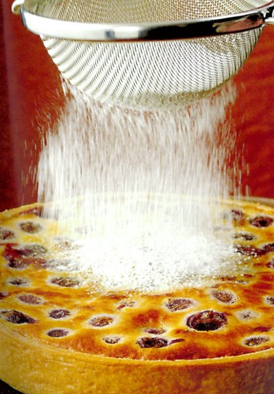

# Cherry clafoutis

*This traditional French dessert is a lovely way to serve soft stone fruit. It also works well with apricots, mirabelles or greengage. Adding a splash of kirsch enhances the flavour of the fruit.*

**Serves:** 6
**Prep Time:** 30 minutes
**Cook Time:** 45 minutes

## Overview
This cherry clafoutis combines a crisp pâte brisée case with a custardy batter filled with juicy cherries and a hint of kirsch. Serve it warm, dusted with icing sugar, to enjoy the soft fruit and golden surface.

## Ingredients
### Pastry
- 240 grams pâte brisée

### Batter
- 1 egg
- 40 grams plain flour
- 40 grams butter (melted and cooled slightly)
- 1 tablespoon kirsch (optional)
- 30 grams caster sugar
- 75 ml cold milk
- 1 vanilla pod (split length ways)

### Filling and finish
- 450 grams very ripe black cherries (pitted)
- icing sugar (to dust)

## Method
### Make the batter
1. Break the egg in a bowl, add the flour and mix using a whisk, without overworking.
2. Add the melted butter and kirsch (if using), then gradually work in the caster sugar and milk.
3. Scrape the vanilla seeds from the pod with the tip of a knife and stir into the mixture.

### Prepare the pastry
1. Roll out the pastry to a round, 3 mm thick, and use it to line an 18 cm diameter (2.5 cm deep) flan ring.
2. Chill the pastry in the refrigerator for at least 20 minutes.

### Blind bake the pastry
1. Preheat the oven to 170°C.
2. Prick the base of the pastry case.
3. Line the pastry case with greaseproof paper, and fill with a layer of baking beans.
4. Bake the case blind in the oven for 15 minutes.
5. Increase the oven temperature to 180°C.
6. Remove the paper and the beans and return the pastry case to the oven for 5 minutes.
7. Leave the pastry case in the flan ring to cool.

### Bake the tart
1. Increase the oven temperature to 200°C.
2. Spread the cherries evenly in the pastry case, then pour in the batter to come just up to the rim.
3. Bake in the hot oven for about 25 minutes, until the surface is a light hazelnut brown colour.
4. Check by gently inserting a knife tip in the centre; if it comes out clean, the clafoutis is done.
5. Slide onto a wire rack and lift off the flan ring.
6. Transfer the clafoutis to a serving plate, dust generously with icing sugar and serve warm.

## Notes
- Blind baking the pastry ensures the base stays crisp beneath the custardy filling.
- Do not overwork the batter; a light mix keeps the clafoutis tender.
- Use cherries with stones intact for a traditional flavour, or pit them for easier eating.
- Let the clafoutis rest briefly before slicing so the filling finishes setting.

## Serving
Serve the clafoutis warm, dusted with icing sugar, for the creamiest texture. It pairs well with whipped cream, crème fraîche, or a scoop of vanilla ice cream.

## Storage
Store any leftovers in the refrigerator for up to 2 days, covered. Reheat gently in a low oven or enjoy cold; freezing is not recommended because the custard texture softens.