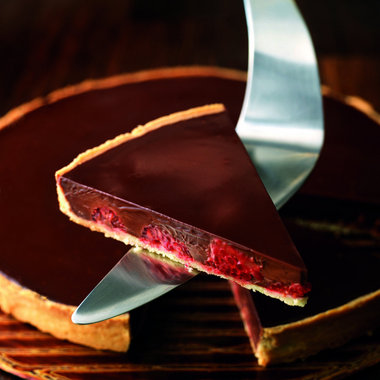

# Chocolate and raspberry tart

**Serves:** 8
**Prep Time:** 30 minutes
**Cook Time:** 30 minutes

## Overview
This elegant tart marries crisp sweet shortcrust pastry with a glossy dark chocolate ganache studded with fresh raspberries. Chill it before serving to allow the ganache to set, then slice with a warmed knife for neat portions.

## Ingredients
### Pastry
- 280 grams [Sweet Shortcrust](../../baking/pastry/sweet-short-pastry.md)

### Filling
- 200 grams fresh raspberries

### Ganache
- 250 ml whipping cream
- 200 grams dark chocolate (preferably 70% cocoa), cut into small pieces
- 25 grams liquid glucose
- 50 grams butter (cut into small pieces)

## Method
### For the pastry
1. On a lightly floured surface, roll out the pastry to a round, 2 - 3 mm thick, and use to line a 22 cm tart ring, 2.5 cm high, placed on a baking tray. Chill for 20 minutes.
1. Preheat the oven to 190°C. Prick the pastry base lightly in a dozen places or so with a fork. 
1. Line the pastry case with greaseproof paper, fill with ceramic baking beans and bake 'blind' for 20 minutes.
1. Remove the paper and baking beans, lower the oven setting to 180°C and bake the pastry case for another 5 minutes. 
1. Transfer to a wire rack and leave until cool enough to handle, then lift off the tart ring.
1. Once cold, arrange the raspberries in the pastry case, pressing them down lightly with your fingertips so that they stick lightly to the base.

### For the ganache
1. Slowly bring the cream to the boil in a pan over a medium heat. Remove from the heat and add the chocolate, using a balloon whisk to mix it in, then add the glucose.
2. Once the mixture is smooth, incorporate the butter, a little at a time.
3. Pour the ganache over the raspberries to fill the pastry case. Leave to cool, then chill the tart in the fridge for at least 2 hours before serving.
4. Use a very sharp knife dipped in boiling water to cut the tart carefully into slices, wiping the knife between each slice. Serve cold, but not straight from the fridge.

## Notes
- Blind bake the pastry shell to ensure it stays crisp beneath the ganache.
- Chill the tart thoroughly so the ganache sets cleanly and holds its shape.
- Use a warmed knife and wipe between cuts for neat slices.
- Fresh raspberries should be added before pouring the ganache so they stay suspended.

## Serving
Serve the tart chilled or just removed from the fridge, allowing it to soften slightly before cutting. Pair with crème fraîche or a dusting of cocoa powder for an elegant finish.

## Storage
Keep the tart refrigerated for up to 3 days. Cover it well to prevent it from absorbing fridge odors; do not freeze, as the ganache texture will degrade. 
