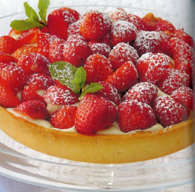

# Strawberry tart

*For this tart filling, the crème pâtissière should be strongly flavoured with vanilla or, better still, the grated zest of 2 oranges.*

*Assemble the tart just before serving to enjoy it at its best.*

**Serves:** 6
**Prep Time:** 30 minutes
**Cook Time:** 40 minutes

## Overview
This strawberry tart features a crisp sweet shortcrust shell filled with a light blend of crème pâtissière and crème chantilly, topped with fragrant ripe strawberries. Assemble it just before serving so the pastry remains crisp and the fruit stays bright.

## Ingredients
### Pastry
- 250 grams [Sweet shortcrust pastry](../../baking/pastry/sweet-short-pastry.md)

### Filling
- 300 grams [crème chantilly ](../../baking/cremes/creme-chantilly.md)
- 150 grams [crème pâtissière](../../baking/cremes/creme-patissiere.md)

### Topping
- 750 grams very ripe fragrant strawberries
- a few mint sprigs
- icing sugar (to dust)

## Method
### Prepare the pastry
1. Roll out the pastry to a round, 2 - 3 mm thick and use to line an 18 cm diameter (2.5 cm deep) flan ring.
1. Rest the pastry in the refrigerator for 20 minutes.

### Blind bake the pastry
1. Preheat the oven to 190°C.
1. Prick the pastry base with a fork.
1. Line the pastry case with greaseproof paper, and fill with a layer of baking beans.
1. Bake the pastry case blind in the oven for 25 minutes.
1. Remove the paper and the beans and return the pastry case to the oven for 15 minutes.
1. Leave the pastry to rest for 5 minutes, then unmould onto a wire rack.

### Making the filling
1. Halve the strawberries if they are large.
1. Delicately fold the crème chantilly into the crème pâtissière and fill the pastry case with this mixture.
1. Arrange the strawberries in top, heaping them up slightly in the centre.

### Serving
1. Slide the tart onto a serving plate, decorate with mint sprigs and dust lightly with icing sugar to serve.

## Notes
- Blind bake and cool the pastry case fully before filling to keep the base crisp.
- Fold the crème chantilly gently into the crème pâtissière so the filling remains light.
- Use the ripest strawberries you can find and assemble just before serving.
- Dusting with icing sugar adds a pretty finish and balances the fruit sweetness.

## Serving
Serve the tart immediately after assembly at room temperature. It is perfect with a spoonful of crème fraîche or a simple fruit coulis.

## Storage
Store any leftover tart in the refrigerator for up to 1 day, covered lightly to avoid crushing the fruit. Because the pastry softens quickly, this tart is best eaten the same day.