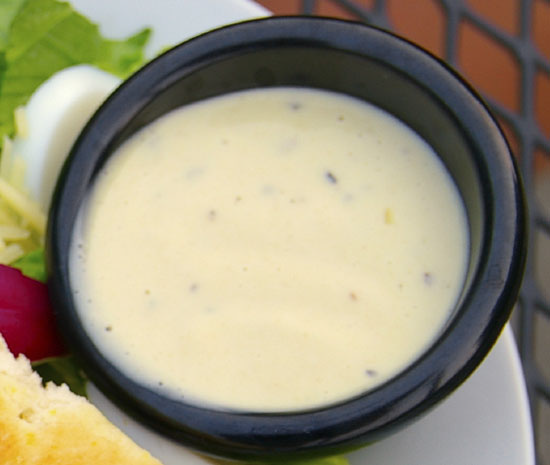

# Caesar Dressing

*This creamy, umami-loaded dressing exemplifies the power of anchovies paired with Parmesan. Raw egg yolk creates luxurious emulsion while lemon and garlic provide brightness and pungency. This is a robust, assertive condiment designed specifically for sturdy Cos lettuce that can stand up to its intensity.*

**Yield:** Approximately 150 milliliters (4-6 servings)

## Overview
Caesar dressing transcends simple vinaigrette through raw egg yolk (creating richness and thicker emulsion), anchovy essence (providing deep umami), and Parmesan cheese (adding complexity). The result is a creamy dressing far more substantial than basic vinaigrette, with an assertive flavor profile that demands equally robust greens. Cos lettuce, with its sturdy texture and slight bitterness, is the perfect partner.

## Ingredients

### Base (Emulsion)
- 1 egg yolk (room temperature, from fresh eggs)
- 1/8 teaspoon Dijon mustard
- 75 milliliters groundnut oil
- 1 tablespoon fresh lemon juice

### Aromatics & Umami
- 1/8 clove garlic (crushed to paste)
- 1 tablespoon anchovy essence (or 15 grams anchovy fillets, finely chopped)
- 30 grams Parmesan cheese (finely grated)

### Finishing
- 2 tablespoons water
- Fine sea salt and freshly ground black pepper (to taste)

## Method

### Stage 1 – Prepare Base Emulsion
1. Place 1 room-temperature egg yolk in a clean, dry bowl.
1. Add 1/8 teaspoon Dijon mustard, 1 tablespoon fresh lemon juice, and 1/8 clove garlic crushed to paste.
1. Whisk vigorously for 1-2 minutes; mixture should become thick and pale yellow.

### Stage 2 – Incorporate Anchovy
1. Add 1 tablespoon anchovy essence to the whisked mixture.
1. Whisk thoroughly for 1-2 minutes; the anchovy will initially darken the mixture, this is correct.
1. The mixture should smell intensely savory and umami-forward.

### Stage 3 – Emulsify with Oil
1. While whisking constantly, add 75 milliliters groundnut oil in a very thin stream, initially just drops.
1. As the oil incorporates and dressing thickens, gradually increase flow.
1. Do not stop whisking; continuous whisking is essential.
1. Once you've added about 1/3 of the oil and mixture is visibly thicker, add remaining oil in slightly faster stream while whisking.
1. Continue until all oil is incorporated and dressing is creamy and thick.

### Stage 4 – Add Parmesan & Water
1. Add 30 grams finely grated Parmesan cheese; whisk thoroughly for 1-2 minutes until fully incorporated.
1. Add 2 tablespoons water in slow stream while whisking; dressing will loosen and become more pourable.

### Stage 5 – Season & Taste
1. Taste the dressing (careful, it will be very savory).
1. Add fine sea salt if needed (anchovy and Parmesan provide substantial salt).
1. Add freshly ground black pepper to taste, approximately 3-4 grinds is typical.
1. Whisk once more to distribute seasoning.

## Notes
- **Raw Egg Safety:** Use only fresh, high-quality eggs. Those with concerns can use pasteurized eggs or substitute 1-2 teaspoons mayonnaise.
- **Anchovy Essential:** This ingredient is not optional; it's Caesar dressing's core character.
- **Parmesan Quality Matters:** Use freshly grated Parmigiano-Reggiano, never pre-grated powder.
- **Emulsification Critical:** Constant whisking creates smoothness. If dressing breaks, start fresh with new egg yolk.
- **Texture & Consistency:** Final dressing should be creamy but pourable; add more water if too thick.
- **Strong Foods Pair Together:** This dressing requires equally assertive lettuce; delicate mesclun will be overwhelmed.

## Variations
**Extra Garlicky:** Increase garlic to 1/4 clove; let sit in lemon juice 10 minutes before whisking.
**With Worcestershire:** Add 1/2 teaspoon Worcestershire during water-addition stage.
**Lighter Version:** Reduce egg yolk to 1/2 and increase water to 3-4 tablespoons for thinner consistency.
**Spicier:** Add pinch of cayenne pepper or hot paprika during seasoning.
**With Mustard Emphasis:** Increase Dijon mustard to 1/4 teaspoon.

## Serving
Use with: Cos lettuce (primary), romaine, radicchio, sturdy lettuces, grilled chicken, croutons, Parmesan shavings
Dressing ratio: 2-3 tablespoons per serving
Temperature: Room temperature
Timing: Apply just before eating

## Storage
- Refrigerate in sealed glass jar for up to 2-3 days maximum
- Emulsion will eventually separate; whisk vigorously to re-emulsify before serving
- Raw egg content means limited shelf-life compared to vinegar-based versions
- Do not freeze; freezing breaks emulsion
- Best consumed the day of preparation
- Discard immediately if any off-odors or mold appear